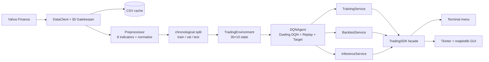
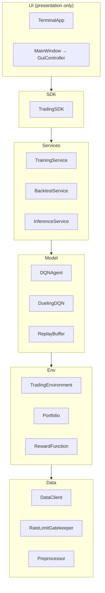

# TradeDQN — Stock-Trading Agent via a Dueling Deep Q-Network

> Bar-Ilan University · Vibe Coding Workshop · **Assignment 2**
>
> ⚠️ **Teaching tool, not investment advice.** No profitability is claimed or
> implied, and **past performance does not predict future results.** The agent
> is trained and evaluated only to demonstrate Deep Q-Learning — do not trade on it.

A reinforcement-learning agent that learns a discrete **Buy / Hold / Sell**
policy on historical market data. It replaces Assignment 1's tabular Q-table
with a **Dueling Deep Q-Network** — a neural network that *approximates* Q —
because the trading state space (a 30-day × 10-feature window) is effectively
infinite and can't fit in a table.

## Objective

Show the progression **finite Q-table → Bellman update → neural approximation
(DQN) → a working DQN-stock system**: connect real market data, engineer
features, wrap them in an RL environment, train a Dueling DQN with experience
replay and a target network, and **backtest** the policy against a Buy & Hold
benchmark — all behind one SDK with both a terminal and a GUI.

## What's implemented

- **Data** — `DataClient` pulls OHLCV from Yahoo Finance with a **rate-limit
  gatekeeper** (§5) and a local CSV cache (offline, reproducible).
- **Features** — 8 market indicators (returns, normalized price, High-Low range,
  volume change, ratio-to-MA, volatility, **RSI**, **MACD**), normalized
  *fit-on-train* (no look-ahead), chronological train/val/test split.
- **Environment** — `TradingEnvironment`: 30×10 state (8 market + 2 portfolio
  channels), Sell/Hold/Buy, reward `rₜ = ΔVₜ − Cₜ − Sₜ + λ·Sharpeₜ`.
- **Model** — Dueling Conv1D DQN, experience replay, target network.
- **Services** — training loop, backtest (equity vs Buy & Hold + metrics),
  single-step inference.
- **Interfaces** — a **terminal menu** (built first) and a **Tkinter +
  matplotlib GUI**, both over the same `TradingSDK`.

## Architecture (data flow)

The UIs depend only on the SDK; the SDK orchestrates the engine (§4 mandate).



## OOP layers (responsibility separation)



## Network — Dueling Conv1D DQN

```
input (B, 30 days, 10 features)
  → Conv1D 10→32  (k=3, over the TIME axis only)
  → Conv1D 32→64
  → Flatten → Dense(128)
  → split ──> Value head     V(s)      (scalar)
          └─> Advantage head A(s,a)    (3: Sell/Hold/Buy)
  → Q(s,a) = V(s) + A(s,a) − mean_a' A(s,a')
```
Conv1D convolves the **time** axis (features are channels, never convolved
across). The Dueling split learns "how good is this state" separately from
"which action is relatively better".

## The §5 gatekeeper

Yahoo Finance rate-limits rapid calls. `RateLimitGatekeeper` enforces a minimum
interval **and** a max-calls-per-window before any live fetch; `DataClient` is
**cache-first** (returns the local CSV when present), so one 10-year pull is
cached and every subsequent run is offline and reproducible.

## Installation

```bash
uv sync --dev
```

## Running

```bash
uv run main.py          # terminal menu: Prepare → Train → Backtest → Recommend
uv run main.py gui      # Tkinter + matplotlib dashboard

# regenerate the results below (fetches Yahoo once, then trains + backtests):
uv run python scripts/generate_results.py --episodes 40
```

## Results & analysis

<!-- RESULTS:START (filled by scripts/generate_results.py) -->
**Real run — AAPL, 2014–2024.** Chronological split: train 1,747 days ·
validation 374 · test 376. Trained **12 episodes** (a fast demo run;
`config/config.yaml` defaults to 300), then evaluated **greedy** on the held-out
**test** slice it never trained on.


| Metric (held-out test, 376 days) | DQN policy | Buy & Hold |
|---|---:|---:|
| Total return | **−14.9 %** | **+12.1 %** |
| Sharpe ratio | −0.58 | — |
| Max drawdown | 21.7 % | — |
| Win rate (round-trips) | 35 % | — |
| Trades | 80 | 1 |
| Latest recommendation | **SELL** | — |

Numbers from [`results/analysis/backtest_metrics.json`](results/analysis/backtest_metrics.json);
reproduce with `uv run python scripts/generate_results.py --episodes 12`.
<!-- RESULTS:END -->

> **Read the equity curve honestly.** The question is **not** "does the line go
> up" — on a rising market almost anything does. It's whether the **DQN policy
> beats Buy & Hold on a risk-adjusted basis** (Sharpe), trades economically
> (few trades, low drawdown), and **generalises to the held-out test slice it
> never trained on**. A DQN frequently *underperforms* Buy & Hold out-of-sample
> — and if it does here, that is reported, not hidden. **Past ≠ future.**

## Conclusions

<!-- CONCLUSIONS:START -->
**The DQN underperformed Buy & Hold out-of-sample — and that is reported, not
hidden.** On the 376-day held-out test slice the policy returned **−14.9 %**
while simply buying and holding AAPL returned **+12.1 %**; its Sharpe was
negative (−0.58) and it made **80 trades** (vs 1 for buy-and-hold), so
transaction costs + slippage actively eroded it.

Why — and what it teaches:

- **Undertrained.** 12 episodes is a fast demo run (the config default is 300).
  The per-episode training reward never settled — it swung from +0.19 to +10.4
  and back to −0.97 (see the training chart) — and ε had only decayed to ~0.94,
  so the policy had barely begun to *exploit* what it learned. This is learning
  instability, not a converged result.
- **Reward shaping ≠ P&L.** Episode 1 had a *positive* shaped reward yet ended
  ~30 % down in portfolio value. The per-step + λ·Sharpe reward can be positive
  while the round-trip P&L is negative — a concrete reminder that the reward you
  optimise is not the metric you ultimately care about.
- **Markets are hard, and that's the point.** Beating Buy & Hold out-of-sample
  is genuinely difficult; the goal of this assignment is a *correct, honest* DQN
  system, not a profitable one. **Past ≠ future.**

**What I'd do differently:** train to the configured 300 episodes (or until the
reward curve flattens); decay ε faster so the backtested policy is actually
exploitative; penalise trade frequency harder to cut the 80-trade churn; and run
a small hyperparameter sweep (γ, learning rate, λ) on the **validation** split
before touching test.
<!-- CONCLUSIONS:END -->

## Cost of AI-assisted development

Runtime cost is negligible (a tiny Conv1D net, sub-ms inference); the real cost
is the human attention spent verifying generated code. Full breakdown in
[`docs/COST_ANALYSIS.md`](docs/COST_ANALYSIS.md) (§11). How the work was done —
PRD-first, 10 phases, the decisions and the AI-rework tax — is in
[`docs/PROMPTS.md`](docs/PROMPTS.md).

## Quality bar (ISO/IEC 25010 lens, §13)

| 25010 attribute | How it shows up here | Evidence |
|---|---|---|
| Functional suitability | full pipeline works end-to-end | `tests/integration/test_sdk.py` |
| Reliability | deterministic seeds; checkpoint reload reproduces | `test_agent`, `test_sdk` |
| Maintainability | ≤150-line single-purpose modules; SDK boundary; DRY | file-size gate, `assemble_state` reuse |
| Security | §5 rate-limit gatekeeper; `weights_only` load; path-traversal guard; secret-scan | `gatekeeper.py`, `agent.load`, `assert_in_project` |
| Performance efficiency | small net, CPU-fine; cache avoids refetch | `docs/COST_ANALYSIS.md` |
| Usability | terminal + GUI, both error-safe | `test_menu`, `test_gui_controller` |

**Gates** (pre-commit + CI): TDD with **100% coverage** (gate ≥85%), zero ruff
violations, ≤150 code lines/file, secret-scan, uv-only.

## Tests

```bash
uv run pytest tests/ --cov=src --cov-report=term-missing
```

## Project structure

```
src/tradedqn/
  data/        DataClient, RateLimitGatekeeper
  features/    indicators, Preprocessor, split + MinMaxNormalizer
  env/         TradingEnvironment, Portfolio, RewardFunction
  model/       DuelingDQN, ReplayBuffer, DQNAgent
  services/    training, backtest, inference, metrics
  gui/         charts, controller, app (Tkinter)
  cli/         terminal menu
  sdk.py       TradingSDK — the single entry point
config/config.yaml   all hyperparameters (no hardcoded values)
docs/          PRDs (per phase), ADRs, PROMPTS, COST_ANALYSIS
main.py        terminal (default) / gui entry point
```

## License

MIT — see [LICENSE](LICENSE).
