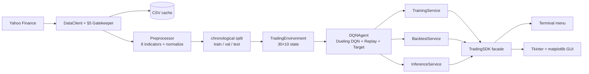
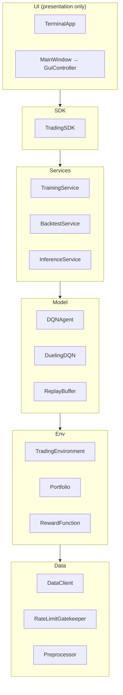

# TradeDQN — Stock-Trading Agent via a Dueling Deep Q-Network

> Bar-Ilan University · Vibe Coding Workshop · **Assignment 2**
>
> ⚠️ **Teaching tool, not investment advice.** No profitability is claimed or
> implied, and **past performance does not predict future results.** The agent
> is trained and evaluated only to demonstrate Deep Q-Learning — do not trade on it.

A reinforcement-learning agent that learns a discrete **Buy / Hold / Sell**
policy on historical market data. It replaces Assignment 1's tabular Q-table
with a **Dueling Deep Q-Network** — a neural network that *approximates* Q —
because the trading state space (a 30-day × 10-feature window) is effectively
infinite and can't fit in a table.

## Objective

Show the progression **finite Q-table → Bellman update → neural approximation
(DQN) → a working DQN-stock system**: connect real market data, engineer
features, wrap them in an RL environment, train a Dueling DQN with experience
replay and a target network, and **backtest** the policy against a Buy & Hold
benchmark — all behind one SDK with both a terminal and a GUI.

## What's implemented

- **Data** — `DataClient` pulls OHLCV from Yahoo Finance with a **rate-limit
  gatekeeper** (§5) and a local CSV cache (offline, reproducible).
- **Features** — 8 market indicators (returns, normalized price, High-Low range,
  volume change, ratio-to-MA, volatility, **RSI**, **MACD**), normalized
  *fit-on-train* (no look-ahead), chronological train/val/test split.
- **Environment** — `TradingEnvironment`: 30×10 state (8 market + 2 portfolio
  channels), Sell/Hold/Buy, reward `rₜ = ΔVₜ − Cₜ − Sₜ + λ·Sharpeₜ`.
- **Model** — Dueling Conv1D DQN, experience replay, target network.
- **Services** — training loop, backtest (equity vs Buy & Hold + metrics),
  single-step inference.
- **Interfaces** — a **terminal menu** (built first) and a **Tkinter +
  matplotlib GUI**, both over the same `TradingSDK`.

## Architecture (data flow)

The UIs depend only on the SDK; the SDK orchestrates the engine (§4 mandate).



## OOP layers (responsibility separation)



## Network — Dueling Conv1D DQN

```
input (B, 30 days, 10 features)
  → Conv1D 10→32  (k=3, over the TIME axis only)
  → Conv1D 32→64
  → Flatten → Dense(128)
  → split ──> Value head     V(s)      (scalar)
          └─> Advantage head A(s,a)    (3: Sell/Hold/Buy)
  → Q(s,a) = V(s) + A(s,a) − mean_a' A(s,a')
```
Conv1D convolves the **time** axis (features are channels, never convolved
across). The Dueling split learns "how good is this state" separately from
"which action is relatively better".

## The §5 gatekeeper

Yahoo Finance rate-limits rapid calls. `RateLimitGatekeeper` enforces a minimum
interval **and** a max-calls-per-window before any live fetch; `DataClient` is
**cache-first** (returns the local CSV when present), so one 10-year pull is
cached and every subsequent run is offline and reproducible.

## Installation

```bash
uv sync --dev
```

## Running

```bash
uv run main.py          # terminal menu: Prepare → Train → Backtest → Recommend
uv run main.py gui      # Tkinter + matplotlib dashboard

# regenerate the results below (fetches Yahoo once, then trains + backtests):
uv run python scripts/generate_results.py --episodes 40
```

A typical session: **Prepare data** (fetch + cache + features + split) → **Train**
(per-episode reward/ε/loss printed) → **Backtest** (equity vs Buy&Hold + metrics)
→ **Recommend** (latest window → Buy/Hold/Sell). Each terminal action prints its
result; the GUI shows the same via a status line + an embedded chart.

## Configuration

All tunable parameters live in [`config/config.yaml`](config/config.yaml) — there
are **no hardcoded values** in source (§7). The file carries a `version` key that
the loader validates at startup. Key groups:

| Group | Keys | Effect |
|---|---|---|
| `data` | `ticker`, `start`, `end`, `interval`, `cache_dir`, `rate_limit.*` | which symbol/period to fetch; §5 gatekeeper throttle + cache |
| `features` | `window_size` (30), `features_count` (10), `names`, indicator periods, `normalize` | the 30×10 state and how indicators are computed/scaled |
| `split` | `train`/`validation`/`test` | chronological split ratios (no look-ahead) |
| `env` | `initial_capital`, `transaction_cost`, `slippage`, `risk_lambda`, `sharpe_window` | reward `r = ΔV − C − S + λ·Sharpe` |
| `network` | `conv_channels` `[32,64]`, `kernel_size`, `dense_units` | Dueling Conv1D DQN shape |
| `training` | `gamma`, `learning_rate`, `epsilon_*`, `replay_capacity`, `batch_size`, `train_frequency`, `target_update_frequency` | the DQN learning loop |

Edit values, re-run — nothing in code needs to change.

## Extending it

The `TradingSDK` constructor is the supported extension surface (dependency
injection): `TradingSDK(cfg=…, data_client=…, agent=…)`. To add:

- **a new indicator** → add one pure function in [`features/indicators.py`](src/tradedqn/features/indicators.py) and reference it in `Preprocessor` + the `features.names`/`features_count` config (one module + config).
- **a new reward term** → add it in [`env/reward.py`](src/tradedqn/env/reward.py) `RewardFunction.compute` (one place; components are returned in `info`).
- **a different data source** → implement an object with `get_ohlcv(...)` and inject it as `data_client` — no engine change.
- **a different network** → swap the `agent`'s policy/target builder; the SDK/UIs are untouched.

## Concurrency & thread safety (§15)

The training loop is **deliberately single-threaded**. The two cost centres are
**CPU-bound** (PyTorch forward/backward in training & inference) and **I/O-bound**
(the one rate-limited Yahoo fetch, which is cache-first so it usually makes zero
calls). For a single sequential RL loop over one symbol at this scale, process/
thread parallelism adds complexity without a real win, and the GIL is not the
bottleneck. `RateLimitGatekeeper` keeps mutable state (a timestamp deque) and is
**single-threaded by contract** — not thread-safe; if training is ever fanned out
(e.g. a parallel multi-ticker sweep), wrap its `acquire`/`execute` in a lock or
give each worker its own gatekeeper.

## Results & analysis

<!-- RESULTS:START (filled by scripts/generate_results.py) -->
**Real run — AAPL, 2014–2024, 120 training episodes.** ε decays to its 0.05
floor by ~episode 58, so the back half of training exploits the learned policy.
Chronological split: train 1,747 days · validation 374 · test 376. Evaluated
**greedy** on the held-out **test** slice it never trained on.


| Metric (held-out test, 376 days) | DQN policy | Buy & Hold |
|---|---:|---:|
| Total return | +4.5 % | **+12.1 %** |
| Sharpe ratio | +0.27 | — |
| Max drawdown | 17.8 % | — |
| Win rate (round-trips) | 36 % | — |
| Trades | 72 | 1 |
| Latest recommendation | **BUY** | — |

**In-sample vs out-of-sample.** On the *training* slice the agent learned to
turn $10 k into **$1–3 million** by the final episodes — yet it returns only
**+4.5 %** on the held-out test. That gap is the real story (see Conclusions).

Numbers from [`results/analysis/backtest_metrics.json`](results/analysis/backtest_metrics.json);
reproduce with `uv run python scripts/generate_results.py --episodes 120`.
<!-- RESULTS:END -->

> **Read the equity curve honestly.** The question is **not** "does the line go
> up" — on a rising market almost anything does. It's whether the **DQN policy
> beats Buy & Hold on a risk-adjusted basis** (Sharpe), trades economically
> (few trades, low drawdown), and **generalises to the held-out test slice it
> never trained on**. A DQN frequently *underperforms* Buy & Hold out-of-sample
> — and if it does here, that is reported, not hidden. **Past ≠ future.**

## Conclusions

<!-- CONCLUSIONS:START -->
**Training helped — but the headline is a textbook in-sample / out-of-sample
gap.** Longer training (120 episodes, faster ε-decay) moved the held-out result
from −14.9 % / Sharpe −0.58 (an earlier 12-episode run) to **+4.5 % / Sharpe
+0.27**, and the recommendation flipped to BUY. Real improvement — but two
things remain true, and are reported, not hidden:

- **It still loses to Buy & Hold** out-of-sample (+4.5 % vs +12.1 %).
- **It massively overfits.** On the *training* period the policy compounded
  $10 k into **$1–3 million** by the final episodes; on the unseen test period it
  barely moved (+4.5 %). The training-reward curve climbs steeply while test
  performance lags — the agent memorised profitable sequences specific to the
  early years that don't generalise to the most recent ones. This is exactly the
  **overfitting** failure mode from the lecture (learn the manifold; don't
  memorise isolated points), made concrete.

Why, and what I'd do differently:

- **Regularise against overfitting:** dropout / weight decay, a smaller network,
  **early-stopping on the validation Sharpe** (not on training reward), and
  training across **multiple tickers** so the policy can't memorise one symbol.
- **Cut the churn:** 72 trades drag returns through costs/slippage — penalise
  trade frequency harder in the reward.
- **Sweep hyperparameters** (γ, learning rate, λ, network size) on the
  **validation** split before ever touching test.

**Markets are hard, and that's the point.** The deliverable is a correct, honest
DQN *system* with an analysable result — not a profitable trader. **Past ≠
future.**
<!-- CONCLUSIONS:END -->

## Cost of AI-assisted development

Runtime cost is negligible (a tiny Conv1D net, sub-ms inference); the real cost
is the human attention spent verifying generated code. Full breakdown in
[`docs/COST_ANALYSIS.md`](docs/COST_ANALYSIS.md) (§11). How the work was done —
PRD-first, 10 phases, the decisions and the AI-rework tax — is in
[`docs/PROMPTS.md`](docs/PROMPTS.md).

## Quality bar (ISO/IEC 25010 lens, §13)

| 25010 attribute | How it shows up here | Evidence |
|---|---|---|
| Functional suitability | full pipeline works end-to-end | `tests/integration/test_sdk.py` |
| Reliability | deterministic seeds; checkpoint reload reproduces | `test_agent`, `test_sdk` |
| Maintainability | ≤150-line single-purpose modules; SDK boundary; DRY | file-size gate, `assemble_state` reuse |
| Security | §5 rate-limit gatekeeper; `weights_only` load; path-traversal guard; secret-scan | `gatekeeper.py`, `agent.load`, `assert_in_project` |
| Performance efficiency | small net, CPU-fine; cache avoids refetch | `docs/COST_ANALYSIS.md` |
| Usability | terminal + GUI, both error-safe | `test_menu`, `test_gui_controller` |
| Compatibility | stdlib-only GUI (Tkinter), no new GUI dep; CSV/Yahoo data interop; one config consumed by every interface | `gui/`, `data/client.py`, `config/config.yaml` |
| Portability | pure-Python, `uv`-locked install; CPU/MPS device-agnostic; OS-independent paths | `uv.lock`, `model/agent.py` (`device`), `config.assert_in_project` |

**Gates** (pre-commit + CI): TDD with **100% coverage** (gate ≥85%), zero ruff
violations, ≤150 code lines/file, secret-scan, uv-only.

## Tests

```bash
uv run pytest tests/ --cov=src --cov-report=term-missing
```

## Project structure

```
src/tradedqn/
  data/        DataClient, RateLimitGatekeeper
  features/    indicators, Preprocessor, split + MinMaxNormalizer
  env/         TradingEnvironment, Portfolio, RewardFunction
  model/       DuelingDQN, ReplayBuffer, DQNAgent
  services/    training, backtest, inference, metrics
  gui/         charts, controller, app (Tkinter)
  cli/         terminal menu
  sdk.py       TradingSDK — the single entry point
config/config.yaml   all hyperparameters (no hardcoded values)
docs/          PRDs (per phase), ADRs, PROMPTS, COST_ANALYSIS
main.py        terminal (default) / gui entry point
```

## Contributing

Conventions for changes (the project enforces them via pre-commit + CI):

- **TDD** — write the test first; keep coverage ≥ 85% (this repo holds 100%).
- **≤ 150 code lines per `.py`** (blank/comment lines excluded) — `scripts/check_file_sizes.sh`.
- **Zero ruff violations** — `uv run ruff check src/ tests/ analysis/ scripts/ main.py`.
- **No hardcoded values** — everything tunable goes in `config/config.yaml`.
- **uv only** — `uv sync --dev`; run everything via `uv run`.
- Run the full gate before committing:
  `uv run pytest tests/ --cov=src --cov-report=term-missing && uv run ruff check src/ tests/ analysis/ scripts/ main.py`.

## References

- Sutton & Barto (2018), *Reinforcement Learning: An Introduction*, 2nd ed. — RL, Bellman, policy/value.
- Watkins & Dayan (1992), *Q-learning* — the off-policy Q-update.
- Mnih et al. (2015), *Human-level control through deep reinforcement learning*, Nature — **DQN** (experience replay + target network).
- Wang et al. (2016), *Dueling Network Architectures for Deep Reinforcement Learning* — the **Dueling** value/advantage split used here.
- Fischer (2018), survey on *Reinforcement Learning in Financial Markets* — trading env, costs, backtesting.
- Hugging Face *Deep RL Course*, Unit 3 — ε-greedy, Bellman target, replay.
- Standards referenced: ISO/IEC 25010 (product quality), Nielsen's 10 usability heuristics, PEP 8 / ruff for style.

## Credits

- **Data**: [Yahoo Finance](https://finance.yahoo.com/) via [`yfinance`](https://github.com/ranaroussi/yfinance).
- **Libraries**: PyTorch, NumPy, pandas, Matplotlib, PyYAML; tooling: uv, ruff, pytest.
- Built for the Bar-Ilan University Vibe Coding Workshop (Dr. Yoram Segal).

## License

MIT — see [LICENSE](LICENSE).
