# TradeDQN — Stock-Trading Agent via a Dueling Deep Q-Network

> Bar-Ilan University · Vibe Coding Workshop · **Assignment 2**
>
> ⚠️ **Teaching tool, not investment advice.** No profitability is claimed or
> implied, and **past performance does not predict future results.** The agent
> is trained and evaluated only to demonstrate Deep Q-Learning — do not trade on it.

A reinforcement-learning agent that learns a discrete **Buy / Hold / Sell**
policy on historical market data. It replaces Assignment 1's tabular Q-table
with a **Dueling Deep Q-Network** — a neural network that *approximates* Q —
because the trading state space (a 30-day × 10-feature window) is effectively
infinite and can't fit in a table.

## Quick reference (§19)

| Task | Command |
|---|---|
| Install | `uv sync --dev` |
| Run terminal UI | `uv run main.py` |
| Run GUI dashboard | `uv run main.py gui` |
| Tests + coverage | `uv run pytest tests/ --cov=src/tradedqn --cov-report=term-missing` |
| Lint | `uv run ruff check src/ tests/ scripts/ main.py` |
| Regenerate results | `uv run python scripts/generate_results.py` (charts → `results/`) |
| Headline result | AAPL test, 300 ep: **−17.5%** vs Buy & Hold −16.5%, Sharpe −1.66 (honestly negative) |
| Stack | PyTorch Dueling Conv1D DQN · Tkinter+matplotlib GUI · `uv` · 189 tests, 100% coverage |

## Objective

Show the progression **finite Q-table → Bellman update → neural approximation
(DQN) → a working DQN-stock system**: connect real market data, engineer
features, wrap them in an RL environment, train a Dueling DQN with experience
replay and a target network, and **backtest** the policy against a Buy & Hold
benchmark — all behind one SDK with both a terminal and a GUI.

## RL formulation (§10)

The agent learns a **decision policy**, not a price forecast. Every RL element
maps onto this project as follows — grounded in the code, not the textbook:

| RL element | What it is here (trading meaning) | Where in code |
|---|---|---|
| **Agent** | The Dueling-DQN trader: observes a market+portfolio window, picks Sell/Hold/Buy to maximise long-run risk-adjusted portfolio value. | [agent.py](src/tradedqn/model/agent.py) `DQNAgent`, [network.py](src/tradedqn/model/network.py) `DuelingDQN` |
| **Environment** | A Gym-style single-symbol market sim: executes the trade at today's price, advances one day, returns the next state + reward. Decoupled from model and GUI (§5). | [trading_env.py](src/tradedqn/env/trading_env.py) `TradingEnvironment` |
| **State** | A **30×10 tensor** — 8 market features over the trailing 30 days + 2 portfolio channels (`position`, `unrealized_pnl`) broadcast across the window. Built from rows up to and including day `t` only — no look-ahead. | [trading_env.py](src/tradedqn/env/trading_env.py) `assemble_state` / `_state` |
| **Action** | Three discrete all-in/all-out actions: **`Sell=0`, `Hold=1`, `Buy=2`**. `Buy` while holding (or `Sell` while flat) is a harmless no-op. | [config.yaml](config/config.yaml) `actions`, [trading_env.py](src/tradedqn/env/trading_env.py) `step` |
| **Reward** | `rₜ = ΔVₜ − Cₜ − Sₜ + λ·Sharpeₜ` — mark-to-market PnL minus transaction cost and slippage, plus a rolling-Sharpe risk bonus (fraction-of-capital units). Rewards economical, risk-adjusted trading, not turnover. | [reward.py](src/tradedqn/env/reward.py) `RewardFunction.compute` |
| **Episode** | One chronological pass over a single data split (`reset` → repeated `step` until the slice ends). ε decays once per episode; train/val/test are never mixed. | [training.py](src/tradedqn/services/training.py), [trading_env.py](src/tradedqn/env/trading_env.py) `reset`/`step` |
| **Policy** | **ε-greedy** over `argmax_a Q(s,a)` during training (explore with prob ε); **greedy** (`argmax`, ε=0) at backtest, so we evaluate the *learned* policy, not exploration noise. | [agent.py](src/tradedqn/model/agent.py) `act`, [backtest.py](src/tradedqn/services/backtest.py) |
| **Return** | The **discounted cumulative reward** `Gₜ = Σ γᵏ rₜ₊ₖ` (γ = 0.95). This — *not* the next day's price — is what `Q(s,a)` estimates and what the Bellman target trains toward. | [agent.py](src/tradedqn/model/agent.py) `learn`, [config.yaml](config/config.yaml) `training.gamma` |

This definition is realised in the env's `reset()` / `step()` interface (§3).

## What's implemented

- **Data** — `DataClient` pulls OHLCV from Yahoo Finance (AAPL, 2020-01-01→2023-01-01)
  with a **rate-limit gatekeeper** (§5) and a local **parquet cache** (`data/raw/`,
  snappy) + a `{ticker}.csv` fallback — offline, reproducible.
- **Features** — the brief's §4 list, implemented **1:1**: the 8 market features
  (`log_return`, `rsi_14`, `macd`, `macd_signal`, `macd_hist`, `bb_pct`,
  `vwap_dist`, `volume_norm`) + the 2 portfolio channels (`position`,
  `unrealized_pnl`) = exactly the 10 channels §4 enumerates → the **30×10** state.
  Market features are min-max normalized *fit-on-train* (no look-ahead) over a
  chronological 70/15/15 split; per-channel formulas in
  [docs/PRD_features.md](docs/PRD_features.md).
- **Environment** — `TradingEnvironment`: 30×10 state (8 market + 2 portfolio
  channels `position`, `unrealized_pnl`), Sell/Hold/Buy, reward
  `rₜ = ΔVₜ − Cₜ − Sₜ + λ·Sharpeₜ`.
- **Model** — Dueling Conv1D DQN, experience replay, target network.
- **Services** — training loop, backtest (equity vs Buy & Hold + metrics),
  single-step inference.
- **Interfaces** — a **terminal menu** (built first) and a **Tkinter +
  matplotlib GUI**, both over the same `TradingSDK`.

## Lecture deck → implementation (§2)

How each concept from the course deck (*DQN stock trading*, Dr. Yoram Segal) is
expressed in this project:

| Lecture concept | Deck slides | Where it lives here |
|---|---|---|
| Q-Table → **function approximation** (why a table can't span continuous, multi-feature windows) | 3–6, 14–15 | [Concept Q&A #2](#concept-qa); [network.py](src/tradedqn/model/network.py) |
| **RL formulation** — Agent/Environment/State/Action/Reward/Episode/Policy/Return | 7–10 | [RL formulation](#rl-formulation-10); [trading_env.py](src/tradedqn/env/trading_env.py) |
| **Data → state tensor** (the exact 30×10 input shape) | 11–13 | [Dataset (§4)](#dataset-4); [trading_env.py](src/tradedqn/env/trading_env.py) `assemble_state` |
| **Dueling DQN** — value & advantage streams, Q-values | 16–21 | [Network](#network--dueling-conv1d-dqn); `Q=V+A−mean(A)` in [network.py](src/tradedqn/model/network.py) |
| **Exploration & stabilization** — ε-greedy, experience replay, target network | 22–24 | [agent.py](src/tradedqn/model/agent.py), [replay_buffer.py](src/tradedqn/model/replay_buffer.py) |
| **Full training cycle** — reset/step, transitions, batch sampling, Bellman target, loss, weight update | 25 | [training.py](src/tradedqn/services/training.py), [agent.py](src/tradedqn/model/agent.py) `learn` |
| **Backtest & results** — equity curve, Buy & Hold, Sharpe, max drawdown, win rate | 26–27 | [Results & analysis](#results--analysis); [backtest.py](src/tradedqn/services/backtest.py), [metrics.py](src/tradedqn/services/metrics.py) |
| **Tests & OOP architecture** — system & class diagrams, engineering quality | 28–29 | [OOP layers](#oop-layers-responsibility-separation), [Tests](#tests) |
| **Theory** — the agent learns a **decision policy**, not a price forecast | 30–31 | [Objective](#objective), [Concept Q&A #1](#concept-qa) |

## Architecture (data flow)

The UIs depend only on the SDK; the SDK orchestrates the engine (§4 mandate).

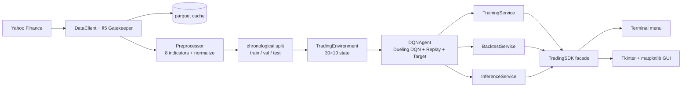

## OOP layers (responsibility separation)

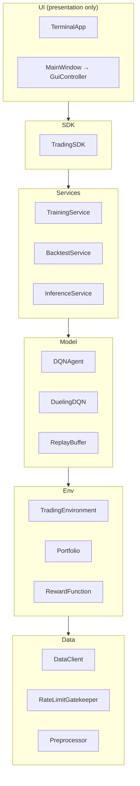

**Sequence — one Prepare → Train → Backtest cycle** (UML, §20.1):

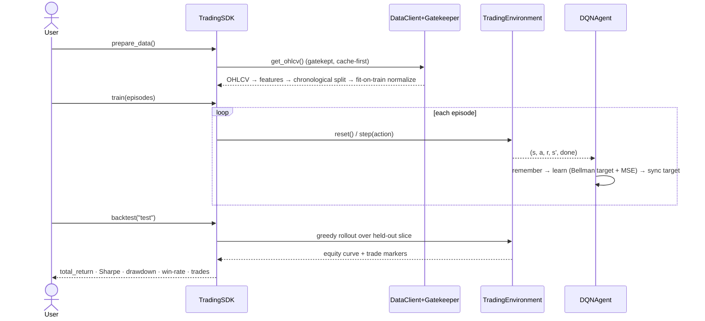

> The Mermaid source for all three diagrams (data-flow, OOP layers, backtest sequence)
> is also kept as standalone files in [`docs/diagrams/`](docs/diagrams/) (§10/§11).

## Network — Dueling Conv1D DQN

```
input (B, 30 days, 10 features)
  → Conv1D 10→32  (k=3, over the TIME axis only)
  → Conv1D 32→64
  → Flatten → Dense(128)
  → split ──> Value head     V(s)      (scalar)
          └─> Advantage head A(s,a)    (3: Sell/Hold/Buy)
  → Q(s,a) = V(s) + A(s,a) − mean_a' A(s,a')
```
Conv1D convolves the **time** axis (features are channels, never convolved
across). The Dueling split learns "how good is this state" separately from
"which action is relatively better" — useful when **Hold is often the sensible
action** and the per-action Q-values barely differ: V(s) is still learned
efficiently without sampling every (s, a).

**The learning rule (Bellman target + MSE).** The policy net is trained to satisfy
the Bellman optimality equation. For a transition `(sₜ, aₜ, rₜ, sₜ₊₁, done)`:

```
y = rₜ + γ · maxₐ' Q(sₜ₊₁, a'; θ⁻) · (1 − done)        # the target
loss = ( Q(sₜ, aₜ; θ) − y )²                            # MSE, minimised by Adam
```

- **`Q(s, a; θ)`** — the online (policy) network's value of action `a` in state `s`, parameters `θ` ([agent.py](src/tradedqn/model/agent.py) `learn`).
- **`y`** — the bootstrapped target: immediate reward plus the discounted best next-state value.
- **`rₜ`** — the reward `ΔV − C − S + λ·Sharpe` (see below).
- **`γ`** — discount factor (`config.training.gamma` = 0.95); weights future reward.
- **`maxₐ' Q(sₜ₊₁, a'; θ⁻)`** — the **target** network's best next-state value; **`θ⁻`** is a frozen copy of `θ`, synced every `target_update_frequency` steps for stability.
- **`(1 − done)`** — zeroes the future term at the episode's last step.

By default this is the **plain-DQN** target (`target(next).max()`). Setting
`config.training.double_q: true` switches to the **Double-DQN** target — the online
net *selects* the next action and the target net *evaluates* it, which curbs the
value over-estimation of the plain max — compared head-to-head in
[Comparative experiments](#comparative-experiments-4-cross-ticker--6-double-dqn--7-reward-design--9-seed-robustness).

## The §5 gatekeeper

Yahoo Finance rate-limits rapid calls. `RateLimitGatekeeper` enforces a minimum
interval **and** a max-calls-per-window before any live fetch; `DataClient` is
**cache-first** (returns the local parquet when present, with a `{ticker}.csv`
fallback), so one pull is cached and every subsequent run is offline and reproducible.

**Least privilege (§20.3).** This bounded access *is* the least-privilege posture:
the app holds no credentials (Yahoo data is keyless/public), reads no runtime
secrets, and reaches exactly one external endpoint — and only on a cache miss,
capped by the gatekeeper's min-interval and per-window quota. Everything else is
the local filesystem (cache, checkpoints, results); no broader network, credential,
or filesystem permission is requested than that one rate-limited read-only fetch needs.

## Dataset (§4)

**Source** (binding): Yahoo Finance via `yfinance`, **AAPL**, **2020-01-01 → 2023-01-01**,
daily (`interval="1d"`), raw columns `Open, High, Low, Close, Volume`. Cached to
`data/raw/AAPL_2020-01-01_2023-01-01.parquet` (snappy) with a `data/raw/AAPL.csv`
fallback. **Reproduce the exact raw pull** with the snippet in
[`docs/PRD_data.md`](docs/PRD_data.md) (the same `yf.download` + parquet/CSV logic, wrapped
in `DataClient` — never pasted into training code).

**Raw OHLCV — 756 rows; first 5:**

| Date | Open | High | Low | Close | Volume |
|---|---:|---:|---:|---:|---:|
| 2020-01-02 | 71.34 | 72.39 | 71.09 | 72.33 | 135,480,400 |
| 2020-01-03 | 71.56 | 72.39 | 71.41 | 71.63 | 146,322,800 |
| 2020-01-06 | 70.75 | 72.24 | 70.50 | 72.20 | 118,387,200 |
| 2020-01-07 | 72.21 | 72.47 | 71.64 | 71.86 | 108,872,000 |
| 2020-01-08 | 71.57 | 73.32 | 71.57 | 73.02 | 132,079,200 |

**After feature engineering — 737 rows** (warmup NaNs dropped); the 8 market features,
first 5 rows:

| Date | log_return | rsi_14 | macd | macd_signal | macd_hist | bb_pct | vwap_dist | volume_norm |
|---|---:|---:|---:|---:|---:|---:|---:|---:|
| 2020-01-30 | −0.0015 | 63.88 | 1.1937 | 1.0045 | 0.1892 | 0.8536 | 0.0384 | −0.0731 |
| 2020-01-31 | −0.0454 | 49.37 | 0.9662 | 0.9968 | −0.0306 | 0.4059 | −0.0101 | 0.4262 |
| 2020-02-03 | −0.0028 | 42.99 | 0.7606 | 0.9496 | −0.1890 | 0.3467 | −0.0143 | 0.2298 |
| 2020-02-04 | 0.0325 | 54.74 | 0.7866 | 0.9170 | −0.1304 | 0.6846 | 0.0155 | −0.0395 |
| 2020-02-05 | 0.0081 | 57.62 | 0.8479 | 0.9032 | −0.0552 | 0.7795 | 0.0209 | −0.1675 |

The env then injects the 2 portfolio channels (`position`, `unrealized_pnl` — the brief's
`unrealised_pnl`, American spelling) at runtime → the **30×10** state tensor, shape
`(N, 30, 10)`. **Split is strictly chronological 70/15/15** (train 515 · val 110 · test 112) —
never shuffled; a `clip-future-highs` test guards against look-ahead leakage.

## Installation

**Prerequisites.** Python **3.11–3.13** (`requires-python = ">=3.11,<3.14"`;
`.python-version` pins 3.11) and the [`uv`](https://docs.astral.sh/uv/) package
manager — `uv` provisions the interpreter and the locked dependency set. Runs
**CPU-only** by default (no GPU required); the agent is device-parameterised
(`DQNAgent(device=…)`), so CUDA/MPS are optional. OS-independent — developed on
macOS, runs on Linux/Windows (the GUI is stdlib Tkinter; `gui/tcl_setup.py` fixes
uv's bundled Tcl/Tk path automatically).

```bash
uv sync --dev
```

Run from the project checkout — `uv` installs the package editable, so
`config/config.yaml` (at the repo root) is found automatically; if it's ever
missing the loader fails with a clear message.

## Running

```bash
uv run main.py          # terminal menu: Prepare → Train → Backtest → Recommend
uv run main.py gui      # Tkinter + matplotlib dashboard

# regenerate the results below (fetches Yahoo once, then trains + backtests):
uv run python scripts/generate_results.py --episodes 300
```

A typical session: **Prepare data** (fetch + cache + features + split) → **Train**
(per-episode reward/ε/loss printed) → **Backtest** (equity vs Buy&Hold + metrics)
→ **Recommend** (latest window → Buy/Hold/Sell). Each terminal action prints its
result; the GUI shows the same via a status line + an embedded chart.

**Action semantics (§3/§7).** Positions are **all-in / all-out**: `Buy` invests *all*
cash; `Sell` liquidates *all* shares; `Hold` does nothing. So `Buy` **while already
holding is a no-op** (no cash left to invest) and `Sell` while flat is a no-op — neither
crashes nor is separately penalised; the agent simply can't act, which is the simplest
faithful model of the deck's "have stock or not" position.

**Checkpoints (§6/§11).** The trained model isn't committed (it regenerates
deterministically). `scripts/generate_results.py` **auto-saves the best model by
validation Sharpe** during training to `results/checkpoints/dqn.pt` (path from
`config.paths.checkpoint`), with run **metadata** (episode + validation metric) — proper
early-stopping selection. The menu's **Save brain** / **Load brain** save/restore on
demand; reload uses `weights_only` (§7 security).

## Configuration

All tunable parameters live in [`config/config.yaml`](config/config.yaml) — there
are **no hardcoded values** in source (§7). The file carries a `version` key that
the loader validates at startup. Key groups:

| Group | Keys | Effect |
|---|---|---|
| `data` | `ticker`, `start`, `end`, `interval`, `cache_dir`, `rate_limit.*` | which symbol/period to fetch; §5 gatekeeper throttle + cache |
| `features` | `window_size` (30), `features_count` (10), `names`, indicator periods, `normalize` | the 30×10 state and how indicators are computed/scaled |
| `split` | `train`/`validation`/`test` | chronological split ratios (no look-ahead) |
| `env` | `initial_capital`, `transaction_cost`, `slippage`, `risk_lambda`, `sharpe_window` | reward `r = ΔV − C − S + λ·Sharpe` |
| `network` | `conv_channels` `[32,64]`, `kernel_size`, `dense_units` | Dueling Conv1D DQN shape |
| `training` | `gamma`, `learning_rate`, `episodes`, `epsilon_*`, `replay_capacity`, `batch_size`, `train_frequency`, `target_update_frequency` | the DQN learning loop |
| (top-level) | `seed` (42), `version` | global RNG seed → reproducible runs; config-schema version (§8) |

Edit values, re-run — nothing in code needs to change. There's a **single config
for a single environment** (§20.3): TradeDQN is a local, single-process tool with
no deployed dev/staging/prod tiers and no secrets store, so per-environment config
templates would add ceremony with nothing to vary.

## Extending it

The design is **API-first**: `TradingSDK` is the stable public surface (the
verb/noun methods `prepare_data` / `train` / `backtest` / `recommend` / `compare` /
`save_brain` / `load_brain`) and the only thing the UIs depend on. Its constructor
is the supported **extension point** — the three injectable seams
`TradingSDK(cfg=…, data_client=…, agent=…)` let you replace the config, the data
source, or the whole agent without touching engine code. There is **no plugin
registry**: extension is plain dependency injection plus the two pure-function
seams below (`features/indicators.py`, `env/reward.py`). To add:

- **a new indicator** → add one pure function in [`features/indicators.py`](src/tradedqn/features/indicators.py) and reference it in `Preprocessor` + the `features.names`/`features_count` config (one module + config).
- **a new reward term** → add it in [`env/reward.py`](src/tradedqn/env/reward.py) `RewardFunction.compute` (one place; components are returned in `info`).
- **a different data source** → implement an object with `get_ohlcv(...)` and inject it as `data_client` — no engine change.
- **a different network** → swap the `agent`'s policy/target builder; the SDK/UIs are untouched. A drop-in `agent` must satisfy the duck-typed contract `act / q_values / q_saliency / remember / learn / save / load` (inference uses `q_values` + `q_saliency`).

> **`scripts/` are a tooling tier, not UIs.** The "UIs depend only on the SDK" rule binds the terminal/GUI; the offline `scripts/` (results, sweeps, ablations) are permitted to import `config` / `data` / `gui.charts` directly — they're batch tools, not the product surface.

**Worked example — add an ATR (Average True Range) indicator.** Three edits, no
engine or UI changes: (1) add a pure function `atr(high, low, close, period)` to
[`features/indicators.py`](src/tradedqn/features/indicators.py) (a `pd.Series` in,
a same-length series out, NaN during warm-up — same contract as the others); (2)
wire it in [`features/preprocessor.py`](src/tradedqn/features/preprocessor.py) (add
`"atr"` to the computed columns and to `MARKET_FEATURES`); (3) declare it in
[`config/config.yaml`](config/config.yaml) — append `atr` to `features.names`, bump
`features_count` 10 → 11 (9 market + 2 portfolio), add `features.atr_period`.
Re-run `uv run main.py` and the new channel flows through normalization, the
`(window × features)` state, the Conv1D Q-net, and both UIs automatically.

## Concurrency & thread safety (§15)

The training loop is **deliberately single-threaded**. The two cost centres are
**CPU-bound** (PyTorch forward/backward in training & inference) and **I/O-bound**
(the one rate-limited Yahoo fetch, which is cache-first so it usually makes zero
calls). For a single sequential RL loop over one symbol at this scale, process/
thread parallelism adds complexity without a real win, and the GIL is not the
bottleneck. `RateLimitGatekeeper` keeps mutable state (a timestamp deque) and is
**single-threaded by contract** — not thread-safe; if training is ever fanned out
(e.g. a parallel multi-ticker sweep), wrap its `acquire`/`execute` in a lock or
give each worker its own gatekeeper.

## User interface & UX (§10)

Two interfaces, both over the same SDK. **Terminal** (real captured session,
[`assets/terminal_session.txt`](assets/terminal_session.txt)):

```
$ uv run main.py
=== TradeDQN ===
  1. Prepare data   2. Train   3. Backtest
  4. Recommend next action   5. Save brain   6. Load brain   0. Quit
Select: 1
Prepared splits: {'train': 515, 'validation': 110, 'test': 112}
Select: 2
Trained 300 episode(s); ε=0.050  final value=344403.66
Select: 3
Backtest: total_return=-17.49%  benchmark=-16.47%  Sharpe=-1.66  max_drawdown=19.41%  win_rate=20.00%  trades=21
Select: 4
Recommended action: BUY  (Q = [13.882, 13.827, 14.056])  ·  confidence 38%  ·  drivers: volume_norm, log_return, macd_hist
```

> Lightly reformatted (menu condensed, input digits inlined) from a real run captured
> verbatim to [`assets/terminal_session.txt`](assets/terminal_session.txt). Seeded
> (`config.seed`), so it reproduces the **Results** numbers below exactly — the menu's
> Train uses the config default of 300 episodes.

**GUI** (Tkinter + matplotlib) — a toolbar drives the SDK with inputs you can
play with: a **ticker** + **date range** (train on AAPL, MSFT, TSLA…), an
**episodes** count, and five actions:

- **Prepare data** — fetch + split + normalize the chosen symbol/range.
- **Train** — streams a **live-animating** reward + ε chart and a progress bar
  episode-by-episode, instead of freezing the window.
- **Backtest** — a two-panel figure: the **price with ▲buy / ▼sell markers**
  (you see *when* the agent traded) over the **equity-vs-Buy & Hold** curve.
- **Recommend** — a **Q-value bar chart** (Sell/Hold/Buy) with the chosen action
  highlighted.
- **Compare arch** — trains a **Dueling** vs a **plain DQN** on the same data and
  overlays their reward curves (the §9 ablation, live from the GUI).

The shot below is the real window (`uv run main.py gui`), captured by
`scripts/capture_gui.py`:

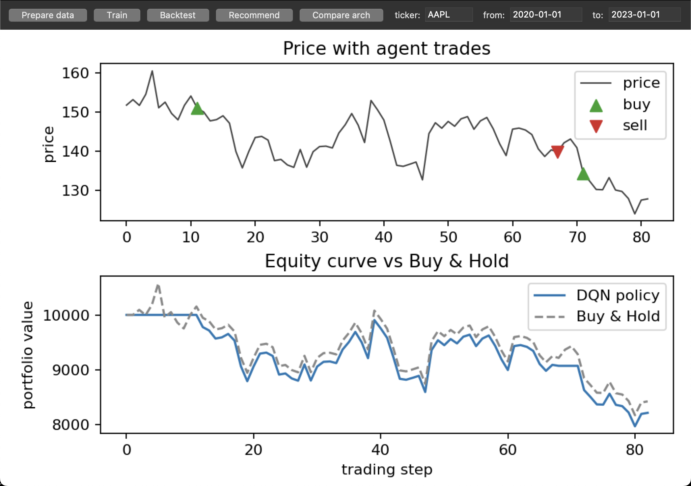

The other GUI states, same window (all real captures via `scripts/capture_gui.py --view …`):

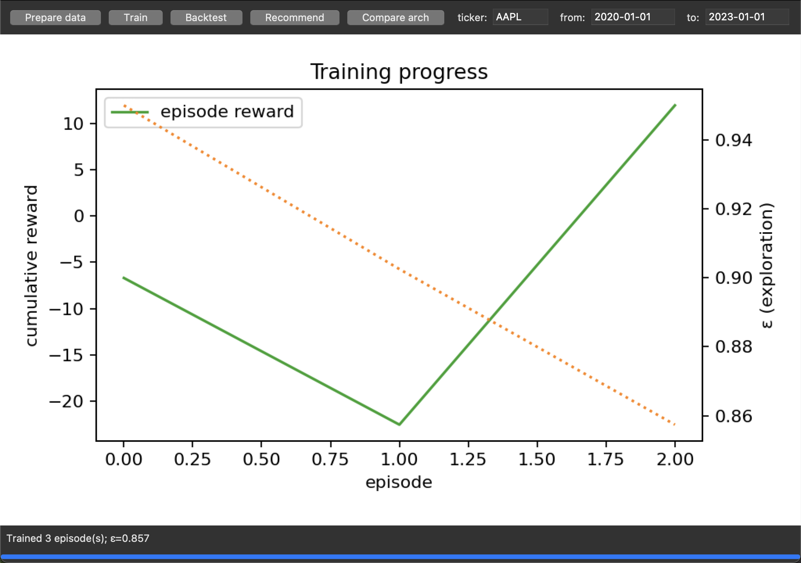
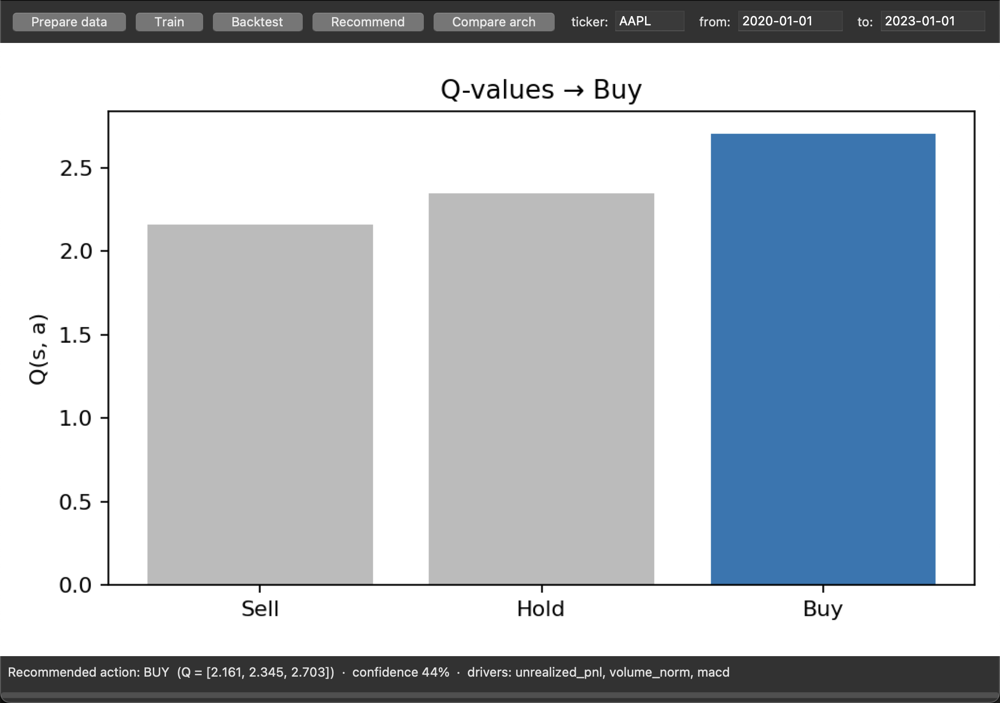
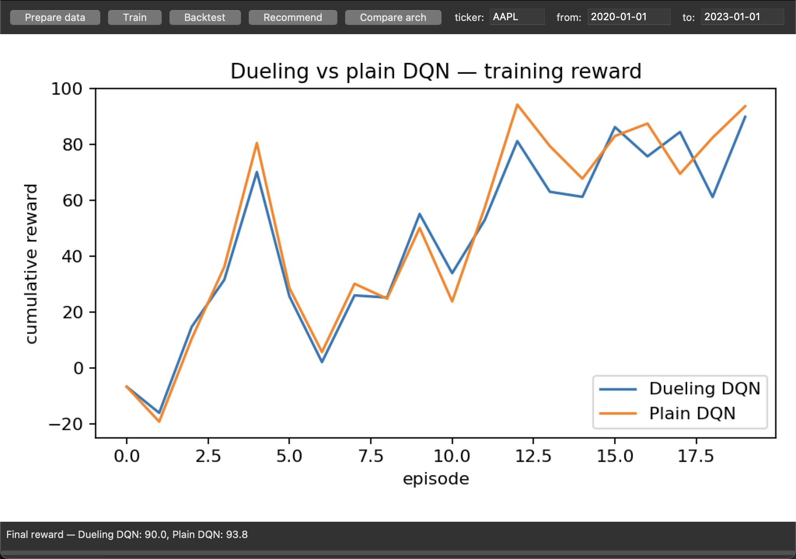

> A genuine capture, not a mockup — regenerate any time with
> `uv run python scripts/capture_gui.py` (seeded, so it reproduces). The numbers
> come from a short demo train; over so few episodes the outcome lands either side
> of Buy & Hold depending on the seed/episode count (the honest small-sample story
> in **Results**) — a *given* seed is deterministic, but few-episode runs are
> high-variance across seeds. The episode count
> defaults from `config.yaml` (`gui.default_train_episodes`); the dueling head is
> toggled by `network.dueling`.
>
> **Running the GUI under uv.** The uv-managed (standalone) Python ships Tcl/Tk
> but hardcodes the build machine's search path, so a bare `tkinter.Tk()` would
> abort with *"Tcl wasn't installed properly."* `gui/tcl_setup.py` fixes this at
> launch by pointing `TCL_LIBRARY`/`TK_LIBRARY` at the interpreter's own bundled
> Tcl/Tk (and leaves a system/Homebrew Python untouched) — so `uv run main.py gui`
> just works, no manual setup.

**UX quality criteria.** *Learnability* — labelled buttons in pipeline order.
*Efficiency* — single keypress / click per action. *Memorability* — the same
Prepare→Train→Backtest→Recommend order in both UIs (the GUI adds Compare).
*Error prevention* — actions are safe in any order; calling Train before Prepare
yields a clear message, not a crash. *Satisfaction* — immediate textual + chart
feedback, with training animating live.

**Nielsen's 10 heuristics.** (1) *Visibility of status* — every action prints/
shows its result + a status line. (2) *Match to real world* — Buy/Hold/Sell,
return, Sharpe, drawdown. (3) *User control* — Quit any time; Save/Load brain.
(4) *Consistency* — identical action set + order across terminal and GUI.
(5) *Error prevention* — handlers are wrapped; misuse surfaces a message.
(6) *Recognition over recall* — labelled menu/buttons, no commands to memorise.
(7) *Flexibility* — terminal for agents/automation, GUI for presentation.
(8) *Aesthetic & minimalist* — only the five GUI buttons (six terminal-menu items); no clutter.
(9) *Help users recover from errors* — `Error: call prepare_data() first` etc.,
caught and shown. (10) *Help & documentation* — this README + `docs/`.

**Accessibility.** Fully **keyboard-operable** (terminal is keyboard-only; Tk
buttons are tab/Enter reachable). Status is **text**, not colour-coded, so it's
screen-reader / colour-blind friendly; chart lines use a distinct colour **and**
a dashed vs solid style (not colour alone). Known limitations: no explicit ARIA/
screen-reader testing; chart colours are not formally CVD-checked.

> **No screencast (§20.2).** A demo video is recommended but not included; in its
> place this README ships a **reproducible terminal session**
> ([`assets/terminal_session.txt`](assets/terminal_session.txt)) and **four real
> GUI screenshots** (dashboard · train · recommend · compare, above), each
> regenerable verbatim with `uv run python scripts/capture_gui.py`. Every figure is
> a genuine capture from a seeded run, not a mockup — the UI is verifiable
> end-to-end without a video.

## Results & analysis

<!-- RESULTS:START (filled by scripts/generate_results.py) -->
**Real run — AAPL, 2020-01-01→2023-01-01 (the binding §4 window), 300 training
episodes.** Chronological split: train 515 days · validation 110 · test 112.
Evaluated **greedy** on the held-out **test** slice it never trained on.

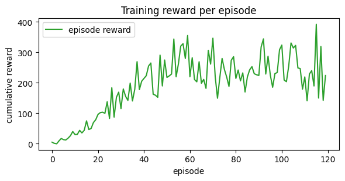

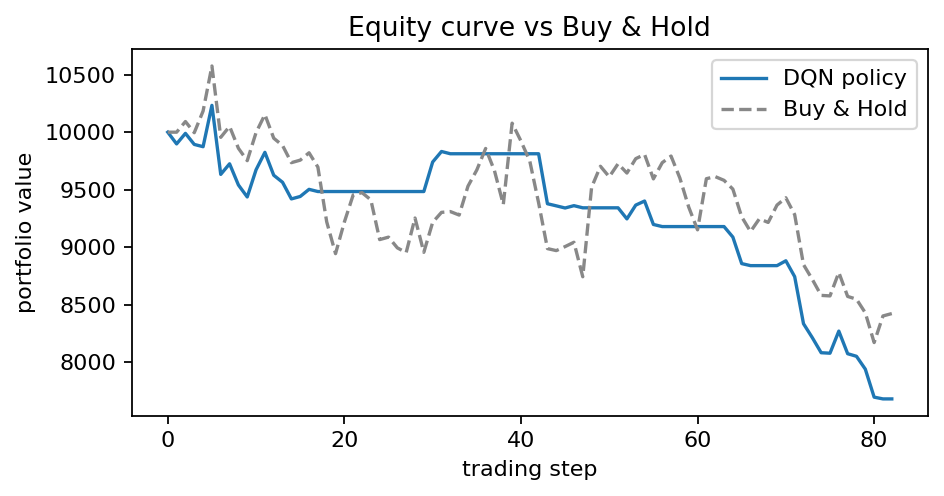

| Metric (held-out test, 112 days) | DQN policy | Buy & Hold |
|---|---:|---:|
| Total return | **−17.5 %** | −16.5 % |
| Sharpe ratio | −1.66 | — |
| Max drawdown | 19.4 % | — |
| Win rate (round-trips) | 20.0 % | — |
| Trades | 21 | 1 |
| Latest recommendation | **BUY** | — |

**The test window is AAPL's 2022 drawdown**, so *both* lost money. The DQN ends
within ~1 point of simply holding (−17.5 % vs −16.5 %) but with a **negative
Sharpe (−1.66)** — no risk-adjusted edge. Set against that, training compounds
the $10k stake to **~$344k in-sample**: a stark in-sample/out-of-sample gap that
is the real finding (see Conclusions).

Numbers from [`results/analysis/backtest_metrics.json`](results/analysis/backtest_metrics.json);
reproduce with `uv run python scripts/generate_results.py --episodes 300`.
**Fully reproducible by design** — the run is seeded (`config.seed`) and pinned on two axes
a naïve seed misses: (1) **Torch is forced single-threaded + deterministic** (`seeding.py`),
because multi-threaded CPU float-accumulation order varies run-to-run; (2) the **exact input
data is committed** as `data/raw/*.parquet` (+ CSV fallback), because a fresh `yfinance`
pull drifts ~1e-4 and chaotic RL training amplifies that into a different result. With both,
a **fresh `git clone` reproduces these numbers bit-for-bit** (verified on a clean checkout).
<!-- RESULTS:END -->

> **Read the equity curve honestly.** The question is **not** "does the line go
> up" — on a rising market almost anything does. It's whether the **DQN policy
> beats Buy & Hold on a risk-adjusted basis** (Sharpe), trades economically
> (few trades, low drawdown), and **generalises to the held-out test slice it
> never trained on**. A DQN frequently *underperforms* Buy & Hold out-of-sample
> — and if it does here, that is reported, not hidden. **Past ≠ future.**

## Conclusions

<!-- CONCLUSIONS:START -->
**The headline is an honest "no demonstrable edge" — exactly what the brief asks
us to surface.** On the held-out 2022 test slice the DQN returns
**−17.5 % (Sharpe −1.66)** versus Buy & Hold's **−16.5 %**: it lands within a
point of simply holding on raw return, but **never beats the benchmark and loses
on a risk-adjusted basis** (negative Sharpe). Two things are true and reported,
not hidden:

- **No risk-adjusted edge out-of-sample** (−17.5 % vs −16.5 %, Sharpe −1.66) —
  it roughly matches Buy & Hold on return but took more risk to get there, so
  holding was strictly the better choice.
- **In-sample ≫ out-of-sample.** Training compounds the $10k stake to **~$344k**
  while the unseen test slice only matches Buy & Hold — the agent fits the
  2020–2021 bull regime and carries no real edge into the 2022 regime shift.
  Textbook overfitting on a single ticker over a single regime.

What's already done about it, and what I'd still do:

- **Select on validation, not training reward** *(mechanism built; didn't help here)* —
  training **checkpoints the best model by validation Sharpe** (`scripts/generate_results.py`,
  saved with metadata). Important honesty point: the **headline reports the final-episode
  policy**, and loading that best-by-validation checkpoint is actually *worse* on test
  (≈ −23 % vs −17.5 %) because validation (2021) and test (2022) are different regimes — so
  early-stopping is implemented but is not a working overfitting remedy on this slice.
- **Test across more than one ticker** *(started)* — the [§4 cross-ticker NVDA
  experiment](#comparative-experiments-4-cross-ticker--6-double-dqn--7-reward-design--9-seed-robustness) shows the verdict
  flips per symbol; a full study still needs many tickers/regimes.
- **Report across seeds, not one** *(done)* — the [§9 seed-robustness study](#comparative-experiments-4-cross-ticker--6-double-dqn--7-reward-design--9-seed-robustness)
  repeats the run over 5 seeds (mean −13.2 % ± 7.5 %); the negative-Sharpe verdict holds
  across **all** of them, though the exact percentage swings 22 points.
- **Sweep hyperparameters** on the **validation** split before touching test *(done —
  see the §9 sweep)*.
- **Still to do:** stronger regularisation (dropout / weight decay, a smaller network)
  and re-weighting the Sharpe-heavy reward (λ=1.0) to curb churn (21 trades in a falling
  market hurt).

**Markets are hard, and that's the point.** The deliverable is a correct, honest
DQN *system* with an analysable result — not a profitable trader. **Past ≠
future.**

**Honest self-assessment.** This is carefully engineered work, reported the way the
brief asks for — transparent scientific reporting rather than a curve-fitted, overstated
positive. The result is stated in full: the policy learns strong in-sample behaviour
(compounding the $10k stake to ~$344k) but shows **no demonstrable risk-adjusted edge
out-of-sample** on AAPL's 2022 drawdown (Sharpe −1.66, robust across 5 seeds). The
limitations are surfaced rather than hidden — overfitting, a largely single-ticker /
single-regime scope (with a cross-ticker NVDA test included), and one deliberately
deferred minor (no env-var config bridge) — and the negative result reflects a genuine
market **regime shift**, not an implementation bug. The deliverable is a correct,
analysable RL system with a truthfully-reported result — markets are hard, and saying so
plainly is the point.
<!-- CONCLUSIONS:END -->

## Comparative experiments (§4 cross-ticker · §6 Double-DQN · §7 reward design · §9 seed robustness)

Four controlled experiments — the two the brief mandates (§4 cross-ticker, §7 reward
design) plus two excellence ablations (§6 Double-DQN target, §9 multi-seed robustness) —
all **seeded + reproducible** off the committed cache. A consolidated
**experiments summary** (hypothesis → result → verdict for all six studies) is in
[`docs/EXPERIMENTS.md`](docs/EXPERIMENTS.md).

```bash
uv run python scripts/compare_experiments.py --episodes 300   # → results/analysis/{cross_ticker,reward_comparison}.{json,png}
uv run python scripts/ablations.py --episodes 300             # → results/analysis/{double_q,seed_variance}.{json,png}
```

### §7 — reward design: basic ΔV vs full risk/cost-adjusted (AAPL test)

Same data, same agent: a *basic* reward (portfolio-value change only, `ΔV`) vs the
*full* reward (`ΔV − cost − slippage + λ·Sharpe`). **Honest caveat:** the basic variant
zeroes the `transaction_cost`/`slippage` config, which removes them from the *simulator*
too — so this contrasts a *basic-reward, cost-free* regime against the full
risk/cost-adjusted one, rather than isolating the reward term in perfect isolation. The
qualitative takeaway (reward design reshapes the policy) holds either way.

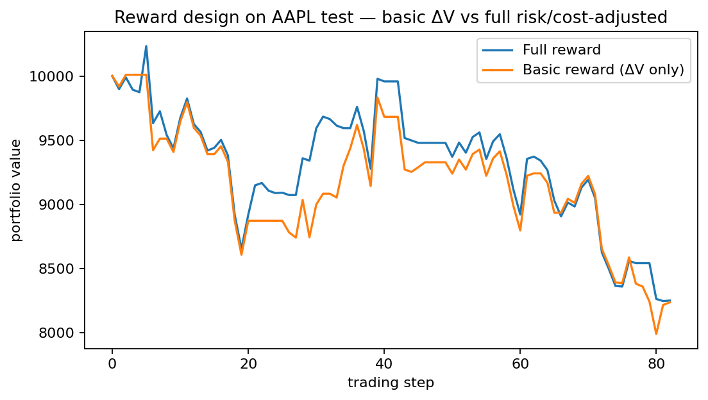

| Reward (AAPL test) | Total return | Sharpe | Max DD | Win rate | Trades |
|---|---:|---:|---:|---:|---:|
| Full (`ΔV − C − S + λ·Sharpe`) | −17.5 % | −1.66 | 19.4 % | 20 % | 21 |
| Basic (ΔV only) | −17.6 % | −1.64 | 20.2 % | 67 % | 19 |

**Conclusion:** on this hard 2022 slice both land at ≈ −17.5 %, but the reward design
**reshapes the policy** — the cost/slippage/risk terms change the trade pattern and
drawdown profile. The end-return parity here is a property of the losing slice; the
full reward's purpose (discipline over-trading, reward risk-adjustment) is what matters
over longer/easier regimes. Reward design changes *what* the agent optimises, not just
the number.

#### Reward decomposition (waterfall, §9.3)

Summing each reward term over the headline test backtest (the four bars sum exactly to
Σ reward; reproduce with `uv run python scripts/reward_waterfall.py`):

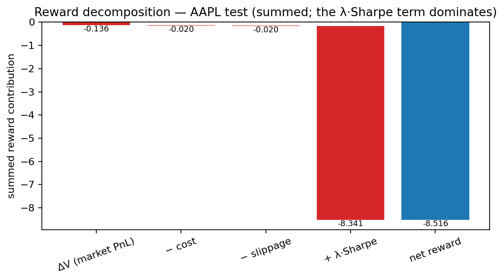

| Term (summed over test) | Contribution |
|---|---:|
| ΔV (market PnL, capital-fraction) | −0.136 |
| − cost | −0.020 |
| − slippage | −0.020 |
| **+ λ·Sharpe** (λ=1.0) | **−8.341** |
| net reward (= Σ rₜ) | −8.516 |

**Finding — the λ·Sharpe term dominates the learning signal.** With λ=1.0 the summed
rolling-Sharpe term (−8.34) is ~**98 %** of the reward magnitude; the actual capital
PnL/cost/slippage terms (≈ −0.18 combined) barely register. So the agent is overwhelmingly
optimising *risk-adjustment*, not raw return — concrete evidence for the Conclusions' note
that the **Sharpe-heavy reward (λ=1.0) is worth re-weighting**. (The capital terms and the
unitless Sharpe term share the reward formula but not a scale, hence the value labels.)

### §4 — cross-ticker: the same pipeline on NVDA

The AAPL pipeline re-run on **NVDA** (identical mechanism; `data/raw/NVDA.csv` committed
for reproducibility), to test whether the result is a property of the *method* or of AAPL.

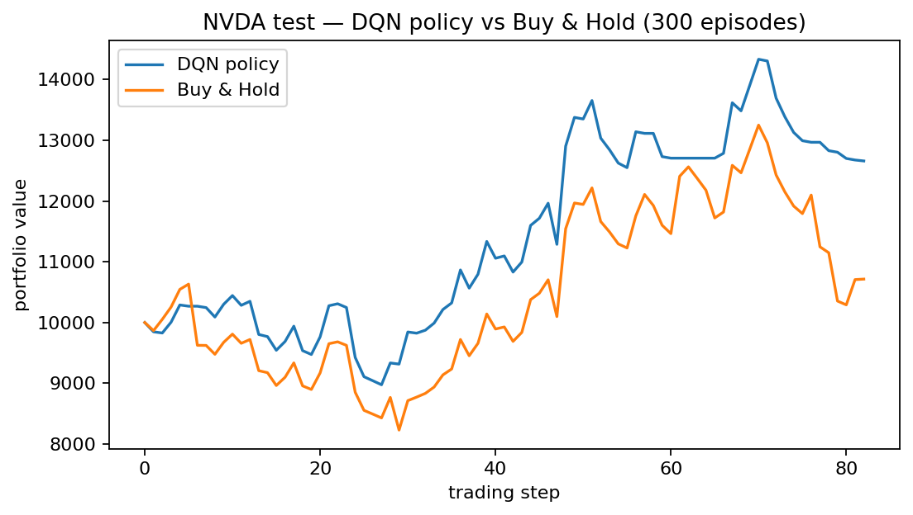

| Held-out test | DQN | Buy & Hold | Sharpe |
|---|---:|---:|---:|
| **AAPL** (headline) | −17.5 % | −16.5 % | −1.66 |
| **NVDA** | **+26.6 %** | +7.1 % | **+1.73** |

**Conclusion — the most important finding.** On NVDA the DQN **beats** Buy & Hold
(+26.6 % vs +7.1 %, positive Sharpe); on AAPL it **loses** (−17.5 % vs −16.5 %, negative
Sharpe). **Same method, opposite verdicts.** This is precisely why a single-ticker
backtest can't establish skill (Concept Q&A #11): the NVDA "win" is just as likely
regime luck as edge. It would take many tickers/regimes with consistent held-out Sharpe
to claim a general policy. **Past ≠ future.**

### §6 — Double-DQN vs vanilla DQN (AAPL test)

Same trunk, same data; **only the Bellman target differs** (`config.training.double_q`):
vanilla takes the target net's `max`, Double-DQN lets the *online* net **select** the next
action and the *target* net **evaluate** it — the standard fix for the `max` operator's
value over-estimation (van Hasselt et al., 2016).

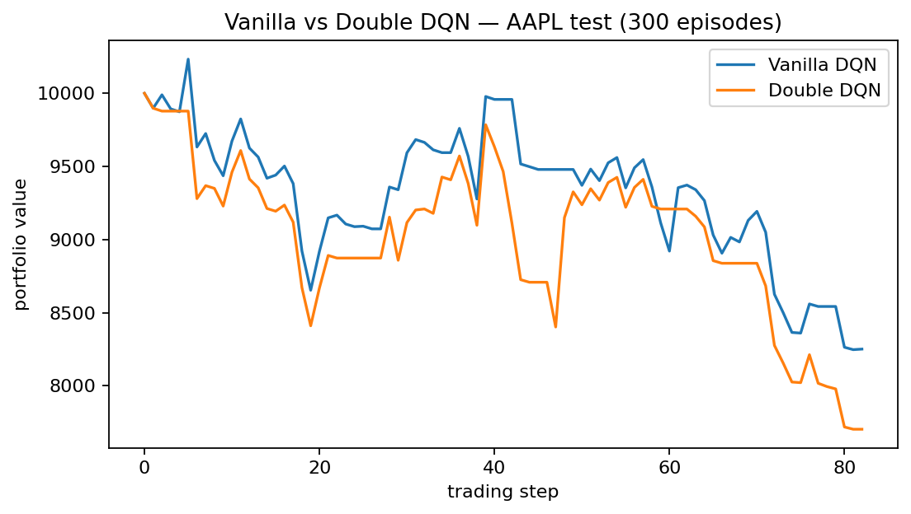

| AAPL test | Total return | Sharpe | Max DD | Win rate | Trades |
|---|---:|---:|---:|---:|---:|
| Vanilla DQN (headline) | −17.5 % | −1.66 | 19.4 % | 20 % | 21 |
| Double DQN | −23.0 % | −2.06 | 23.0 % | 30 % | 20 |

**Conclusion — the right fix for the wrong disease.** Double-DQN curbs *value
over-estimation*, but over-estimation was never the binding failure here: the binding
failure is **overfitting** to the 2020–21 bull regime (in-sample ~$344k vs out-of-sample
≈ Buy & Hold). On the held-out 2022 slice the more conservative target is **slightly worse**
(−23.0 % vs −17.5 %), not better — an honest negative result. It would help where Q-values
genuinely blow up (longer horizons, larger action spaces); it can't fix a generalisation gap.
That it's a one-line, config-toggled change with a passing target-path test
([`test_double_dqn_target_path_learns`](tests/unit/test_agent.py)) is the deliverable —
the verdict is reported, not curated.

### §9 — seed robustness (is the headline a fluke?)

The headline is one seed (42). To check it isn't a lucky/unlucky draw, the full
train→test pipeline is repeated across **five seeds** `[42, 1, 7, 13, 100]` and reported
as mean ± std.

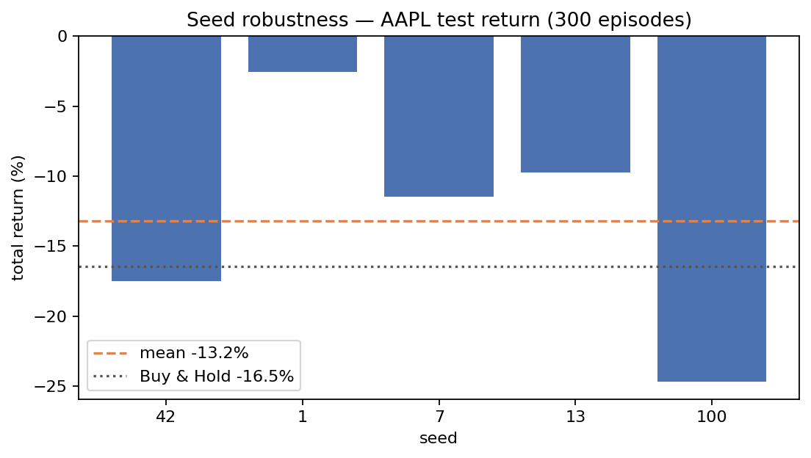

| Seed | Total return | Sharpe | Trades |
|---|---:|---:|---:|
| 42 *(headline)* | −17.5 % | −1.66 | 21 |
| 1 | −2.5 % | −0.02 | 8 |
| 7 | −11.5 % | −0.79 | 15 |
| 13 | −9.7 % | −0.82 | 18 |
| 100 | −24.7 % | −2.81 | 22 |
| **mean ± std** | **−13.2 % ± 7.5 %** | **−1.22 ± 0.95** | |
| **95 % CI** *(t, n=5)* | **[−23.5 %, −2.8 %]** | **[−2.53, +0.10]** | |

**Conclusion — robust verdict, fragile number.** Two things, both reported: (1) **every
seed loses money and posts a negative Sharpe** (best case seed 1 is −2.5 %, Sharpe ≈ 0) —
so "no risk-adjusted edge" is a property of the *method on this slice*, not of seed 42.
But (2) the **spread is large** (−2.5 % to −24.7 %, a 22-point swing; σ ≈ 7.5 pts), so any
*single* seed is a weak point estimate. The headline seed 42 actually sits on the
**pessimistic tail** — the 5-seed mean (−13.2 %) is milder and even edges Buy & Hold
(−16.5 %). The honest reading: the qualitative conclusion is seed-robust, the exact
percentage is not. This is exactly why a one-seed backtest shouldn't be over-read.

A 95 % t-interval (n=5) makes the small sample explicit instead of hiding it. The **return
CI sits entirely below zero** ([−23.5 %, −2.8 %]) — "loses money on this slice" survives as
an *inferential*, not just descriptive, claim. The **Sharpe CI crosses zero** ([−2.53,
**+0.10**]) — the correct read at n=5: we cannot statistically distinguish the risk-adjusted
edge from zero, fully consistent with the "no edge" verdict and an honest refusal to
over-claim significance on five seeds.

## Concept Q&A

The twelve questions the brief requires the README to answer, with pointers to the code:

1. **What does Q represent (vs predicting tomorrow's price)?** `Q(s,a;θ)` is the expected *discounted cumulative reward* of taking action `a` in state `s` then following the policy — the value of a *decision*, not a price forecast. The net never predicts the next price; it ranks Sell/Hold/Buy by long-run portfolio value ([network.py](src/tradedqn/model/network.py)).
2. **Why function approximation, not a Q-Table?** The state `sₜ ∈ ℝ^{30×10}` is continuous and high-dimensional — a table would need a cell per distinct window (effectively infinite, never revisited). A Conv1D net generalises across unseen states via a parametric `Q(s,a;θ)`.
3. **How does the reward shape the policy?** The objective *is* the reward: `rₜ = ΔVₜ − Cₜ − Sₜ + λ·Sharpeₜ` rewards risk-adjusted PnL net of cost, so the agent learns to trade economically rather than maximise turnover ([reward.py](src/tradedqn/env/reward.py)).
4. **Reward = immediate profit only, no trade-cost penalty?** With `rₜ = ΔVₜ` alone, costs are invisible to the Bellman target, so a trade that nets +$1 of price move but −$3 of fees still back-propagates a *positive* Q-value — the agent learns to churn every bar and real returns leak away into fees/slippage. Our reward subtracts the same-step `Cₜ`/`Sₜ` the portfolio actually paid ([reward.py](src/tradedqn/env/reward.py)), so a trade only earns reward if its edge clears its cost; the `λ·Sharpeₜ` term further penalises the return *variance* that pure-profit reward ignores.
5. **Why not mix Test into training; what is leakage?** The split is chronological (never shuffled); Test is strictly *after* train/val. Leakage = letting future info (future prices, or normalization stats fit on the whole series) bleed into training, inflating the backtest. We fit the normalizer on **train only** ([dataset.py](src/tradedqn/features/dataset.py)).
6. **When is Hold optimal?** Hold is optimal exactly when `Q(s,Hold)` is the argmax — i.e. when no trade has positive expected *net* value: the expected price move doesn't cover cost + slippage, or the position is already aligned with the move so trading would only burn fees. Because the state carries the agent's own `position`/`unrealized_pnl` channels ([trading_env.py](src/tradedqn/env/trading_env.py)), Hold is context-dependent — the same market window can favour Hold when already long and Buy when flat. It is the no-op that preserves capital while the cost-aware reward (Q4) makes marginal trades negative-EV.
7. **How does Dueling help when mostly no action is needed?** The value head `V(s)` learns "how good is this state" *independent of action*; the advantage head learns the small per-action deltas. In a hold-dominated environment the shared `V(s)` is learned efficiently without sampling every `(s,a)` ([network.py](src/tradedqn/model/network.py)).
8. **Exploration (training) vs evaluation (backtest)?** Training is ε-greedy (random with prob ε to explore); the backtest is **greedy** (`argmax Q`, ε=0) — we evaluate the learned policy, not exploration noise ([agent.py](src/tradedqn/model/agent.py), [backtest.py](src/tradedqn/services/backtest.py)).
9. **Is Total Return enough?** No — a high return can hide huge risk. We also report **Sharpe** (risk-adjusted), **Max Drawdown** (worst pain), and **Win Rate** (consistency) so a lucky high-variance run can't pass as skill ([metrics.py](src/tradedqn/services/metrics.py) for return/Sharpe/drawdown; [backtest.py](src/tradedqn/services/backtest.py) for win-rate + trade count).
10. **Which env/reward bugs fake a good backtest?** Look-ahead (using `price[t+1]` in the state), normalization fit on the full series, an off-by-one reward (crediting a trade before it executes), or zero transaction cost — all inflate results. Our env executes at `prices[t]` with the next day only as *outcome*, and a test asserts no look-ahead ([trading_env.py](src/tradedqn/env/trading_env.py)).
11. **General policy vs an AAPL quirk?** The [§4 cross-ticker test](#comparative-experiments-4-cross-ticker--6-double-dqn--7-reward-design--9-seed-robustness) answers this directly: the **same method loses on AAPL (−17.5% vs −16.5%) but beats Buy & Hold on NVDA (+26.6% vs +7.1%)**. Opposite verdicts on two symbols is itself the evidence — there's no *consistent* edge, just regime-dependent behaviour. Establishing generality would need consistent held-out Sharpe across **many tickers and regimes**, not one lucky symbol.
12. **Extend to another (financial or non-financial) problem, same RL structure?** The agent/training/backtest/SDK layers touch the env only through `reset()` and `step(action) → (state, reward, done, info)` and a `(window × features) → n_actions` Q-net — nothing in them is trading-specific, so a new domain just supplies a `TradingEnvironment`-shaped class ([Extending it](#extending-it)). **Worked example — warehouse inventory control:** *State* `sₜ` = a 30-day window per SKU `[demand, on_hand_stock, in_transit, lead_time, unit_holding_cost, days_to_expiry, …]`, with the current stock position broadcast as extra channels (mirroring our `position`/`unrealized_pnl`). *Actions* = `{order 0, order Q_small, order Q_large}` — a discrete 3-action set the existing argmax head emits unchanged. *Reward* `rₜ = revenueₜ − holding_costₜ − stockout_penaltyₜ − order_costₜ`, the direct analogue of `ΔVₜ − Cₜ − Sₜ` (holding cost ≙ slippage, stockout penalty ≙ opportunity cost, order cost ≙ transaction cost). The agent learns a *replenishment policy* the same way it learns when a trade's edge beats its fees — a pure swap of the `Environment`.

## Research notebook & sensitivity analysis (§9)

The full research write-up is the Jupyter notebook
[`notebooks/analysis.ipynb`](notebooks/analysis.ipynb): the RL formulation with the
governing equations (Bellman target, Dueling aggregation, reward, Sharpe — in
LaTeX), the held-out backtest with **falsifiable hypotheses** (H1: DQN return >
Buy & Hold; H2: Sharpe > 0) and their verdicts, the **one-at-a-time sensitivity
sweep** over `learning_rate` and `gamma` on the **validation** split (never the
test set), the overfitting analysis, and academic citations.

```bash
uv run python scripts/parameter_sweep.py --episodes 15        # → results/analysis/sweep.{json,png}
uv run --with jupyter jupyter lab notebooks/analysis.ipynb   # open the analysis (jupyter on demand)
```

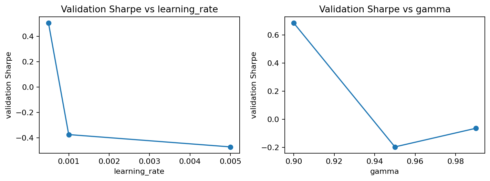

## Originality — what we added beyond the baseline (§12)

The brief's threshold is "reproduce the `DQN-Trader-SDK` at the assembly level." Beyond that
minimum, this project adds:

- **Controlled experiments & ablations** — a [Dueling-vs-plain DQN ablation](#network--dueling-conv1d-dqn)
  (config-toggled), a [cross-ticker generalisation test](#comparative-experiments-4-cross-ticker--6-double-dqn--7-reward-design--9-seed-robustness)
  (NVDA — the verdict *flips* vs AAPL), a [reward-design comparison](#comparative-experiments-4-cross-ticker--6-double-dqn--7-reward-design--9-seed-robustness)
  (basic ΔV vs full risk/cost-adjusted), and a [Double-DQN vs vanilla target ablation](#comparative-experiments-4-cross-ticker--6-double-dqn--7-reward-design--9-seed-robustness)
  (one-line target swap — an honest "didn't help, the binding issue is overfitting" result).
- **Explainability** — every recommendation carries a **confidence** (softmax) and a
  **gradient-saliency feature attribution** ("which features drove this decision").
- **Best-by-validation checkpointing** — the early-stopping *mechanism* (save the
  best model by validation Sharpe, with run metadata) is implemented; the headline
  reports the final-epoch policy, and we honestly report that the checkpoint doesn't
  beat it on the regime-shifted test slice.
- **Research depth** — falsifiable hypotheses with verdicts, an OAT sensitivity sweep on
  validation, a feature-correlation heatmap, a **5-seed robustness study** (mean ± std, so
  the headline isn't read as a fluke), and an honest overfitting analysis (in-sample
  ~$344k vs out-of-sample ≈ Buy & Hold; validation peaks at episode 59).
- **Engineering** — a strict SDK facade, **100% statement+branch coverage**, ≤150-line
  modules, CI + pre-commit gates, seeded bit-for-bit reproducibility, and an installable
  wheel (§14).

**What we learned.** A single-ticker backtest can't establish skill — the same agent beats
Buy & Hold on NVDA and loses on AAPL. Reward design changes the *character* of the policy
(trade count, drawdown, win-rate), not just the number. And the honest deliverable here is a
correct, analysable RL **system** with a truthfully-reported negative result — not a profitable
trader. **Past ≠ future.**

## Cost of AI-assisted development

Runtime cost is negligible (a tiny Conv1D net, sub-ms inference); the real cost
is the human attention spent verifying generated code. Full breakdown in
[`docs/COST_ANALYSIS.md`](docs/COST_ANALYSIS.md) (§11). How the work was done —
PRD-first, 10 phases, the decisions and the AI-rework tax — is in
[`docs/PROMPTS.md`](docs/PROMPTS.md).

## Quality bar (ISO/IEC 25010 lens, §13)

| 25010 attribute | How it shows up here | Evidence |
|---|---|---|
| Functional suitability | full pipeline works end-to-end | `tests/integration/test_sdk.py` |
| Reliability | deterministic seeds; checkpoint reload reproduces | `test_agent`, `test_sdk` |
| Maintainability | ≤150-line single-purpose modules; SDK boundary; DRY | file-size gate, `assemble_state` reuse |
| Security | §5 rate-limit gatekeeper; `weights_only` load; path-traversal guard; secret-scan | `gatekeeper.py`, `agent.load`, `assert_in_project` |
| Performance efficiency | small net, CPU-fine; cache avoids refetch | `docs/COST_ANALYSIS.md` |
| Usability | terminal + GUI, both error-safe | `test_menu`, `test_gui_controller` |
| Compatibility | stdlib-only GUI (Tkinter), no new GUI dep; CSV/Yahoo data interop; one config consumed by every interface | `gui/`, `data/client.py`, `config/config.yaml` |
| Portability | pure-Python, `uv`-locked install; CPU by default (device-parameterised); OS-independent paths | `uv.lock`, `model/agent.py` (`device`), `config.assert_in_project` |

**Gates** (pre-commit + CI): TDD with **100% coverage** (gate ≥85%), zero ruff
violations, ≤150 code lines/file, secret-scan, uv-only.

## Tests

**189 tests · 100% statement + branch coverage** (the suite *fails* under 85%). Run:

```bash
uv run pytest tests/ --cov=src/tradedqn --cov-report=term-missing
```

Every layer the brief (§9) lists has a test (TDD, RED→GREEN→REFACTOR):

| Component | Test file(s) |
|---|---|
| Config load + version validation | `test_config` |
| Dataset / `DataClient` + §5 gatekeeper | `test_data_client`, `test_gatekeeper` |
| Feature engineering + chronological split | `test_indicators`, `test_preprocessor`, `test_dataset` |
| Environment, reward, portfolio | `test_trading_env`, `test_reward`, `test_portfolio` |
| Replay buffer | `test_replay_buffer` |
| Network forward + dueling/plain ablation | `test_network` |
| Training step, target sync, **checkpoint save/load** | `test_agent`, `test_training` |
| Backtest + metrics, inference, SDK | `test_backtest`, `test_metrics`, `test_inference`, `test_sdk` |
| Seeding / reproducibility | `test_seeding` |
| Terminal + GUI logic | `test_menu`, `test_gui_controller`, `test_charts`, `test_format` |

**RED → GREEN → REFACTOR — two worked examples (§9):**

1. **`RewardFunction`** (`env/reward.py`, `test_reward.py`). **RED:** wrote
   `test_components_are_fraction_units` + `test_hold_with_no_fees_is_pure_return`
   *first* — they failed (no `RewardFunction` yet). **GREEN:** implemented
   `compute()` returning `(ΔV − C − S)/capital + λ·Sharpe` until both passed.
   **REFACTOR:** extracted the rolling-Sharpe deque + the `std == 0` guard into a
   helper and exposed the reward *components* in `info` for transparency
   (`test_lambda_zero_removes_sharpe_term` locks the λ knob) — tests stayed green.
2. **Look-ahead-safe normalizer** (`features/dataset.py`, `test_dataset.py`). **RED:**
   wrote `test_uses_train_stats_and_clips_future_highs` first — asserting the
   normalizer fit on **train** clips a future val/test high to ≤ 1.0; it failed
   against a naive fit-on-all version. **GREEN:** `MinMaxNormalizer.fit(train).transform(...)`
   with clipping. **REFACTOR:** shared the transform across train/val/test and added
   the chronological-order assertion — the leakage guard the whole backtest depends on.

(The reverse also happened post-review: a flat-price input crashed the indicators with
`pd.NA.astype(float)` despite 100% coverage → added `TestZeroDivisorSafety` (RED), switched
`pd.NA`→`np.nan` (GREEN), applied the guard across all four indicators (REFACTOR).)

Latest run:

```text
$ uv run pytest tests/ -q
...
TOTAL                                     931      0    146      0   100%
Required test coverage of 85% reached. Total coverage: 100.00%
189 passed in 4.4s
```

## Project structure

```
src/tradedqn/
  data/        DataClient, RateLimitGatekeeper
  features/    indicators, Preprocessor, split + MinMaxNormalizer
  env/         TradingEnvironment, Portfolio, RewardFunction
  model/       DuelingDQN, ReplayBuffer, DQNAgent
  services/    training, backtest, inference, metrics
  gui/         charts, controller, app (Tkinter)
  cli/         terminal menu
  sdk.py       TradingSDK — the single entry point
config/config.yaml   all hyperparameters (no hardcoded values)
docs/          PRDs (per phase), ADRs, PROMPTS, COST_ANALYSIS
main.py        terminal (default) / gui entry point
```

## Contributing

Conventions for changes (the project enforces them via pre-commit + CI):

- **TDD** — write the test first; keep coverage ≥ 85% (this repo holds 100%).
- **≤ 150 code lines per `.py`** (blank/comment lines excluded) — `scripts/check_file_sizes.sh`.
- **Zero ruff violations** — `uv run ruff check src/ tests/ scripts/ main.py`.
- **No hardcoded values** — everything tunable goes in `config/config.yaml`.
- **uv only** — `uv sync --dev`; run everything via `uv run`.
- Run the full gate before committing:
  `uv run pytest tests/ --cov=src/tradedqn --cov-report=term-missing && uv run ruff check src/ tests/ scripts/ main.py`.

**Review process.** This is a single-author project, so there is no pull-request
flow — development lands on `main`. The role peer review plays on a team is
filled here by two gates: the **human↔AI responsibility contract** in `CLAUDE.md`
(requirements, architecture, test-acceptance, and final sign-off are
human-decided before any AI-generated change lands) and the **automated CI gate**
(tests + coverage + lint + file-size + secret-scan must pass). Commit messages
name the change's intent, giving a reviewable development arc.

## References

**Assignment base & data tools** (§16):

- [`rmisegal/DQN-stock`](https://github.com/rmisegal/DQN-stock) — the course's **DQN-Trader-SDK** reference project this assignment is built on. We reproduced it at the *assembly* level (layered SDK, Gymnasium-style env, Dueling DQN) and re-designed/justified the code rather than copying it.
- [`yfinance`](https://github.com/ranaroussi/yfinance) — Yahoo Finance market-data downloader; the binding §4 data source (`yf.download`, daily OHLCV).
- [Gymnasium](https://gymnasium.farama.org/) — the `reset()`/`step()` environment API style the `TradingEnvironment` follows.

**Reinforcement-learning literature**:

- Sutton & Barto (2018), *Reinforcement Learning: An Introduction*, 2nd ed. — RL, Bellman, policy/value.
- Watkins & Dayan (1992), *Q-learning* — the off-policy Q-update.
- Mnih et al. (2015), *Human-level control through deep reinforcement learning*, Nature — **DQN** (experience replay + target network).
- Wang et al. (2016), *Dueling Network Architectures for Deep Reinforcement Learning* — the **Dueling** value/advantage split used here.
- van Hasselt, Guez & Silver (2016), *Deep Reinforcement Learning with Double Q-learning*, AAAI — the **Double-DQN** target (online net selects, target net evaluates) offered as the §6 `double_q` toggle.
- Schaul et al. (2016), *Prioritized Experience Replay* — referenced by the brief; **not** used here (we use uniform replay, a deliberate simplification — see Conclusions).
- Fischer (2018), survey on *Reinforcement Learning in Financial Markets* — trading env, costs, backtesting.
- Hugging Face *Deep RL Course*, Unit 3 — ε-greedy, Bellman target, replay.
**Standards & sources referenced** (§18):
- **ISO/IEC 25010** — product-quality model; the "Quality bar" table maps all 8 characteristics.
- **Nielsen's 10 usability heuristics** — mapped in the UI & UX section.
- **PEP 8 / ruff** — code style, enforced in CI + pre-commit.
- **MIT Software QA Plan** — informs the verification plan (TDD, 100% statement+branch coverage, lint/secret/file-size gates).
- **Google Engineering Practices** (*eng-practices*) — small, reviewable changes + commit-intent / sign-off discipline (the human↔AI review process).
- **Microsoft REST API Guidelines** — consistent verb/noun naming applied to the SDK's public surface (`prepare_data` / `train` / `backtest` / `recommend`).

## Credits

- **Data**: [Yahoo Finance](https://finance.yahoo.com/) via [`yfinance`](https://github.com/ranaroussi/yfinance).
- **Libraries**: PyTorch, NumPy, pandas, Matplotlib, PyYAML; tooling: uv, ruff, pytest.
- Built for the Bar-Ilan University Vibe Coding Workshop (Dr. Yoram Segal).

## License

MIT — see [LICENSE](LICENSE).
