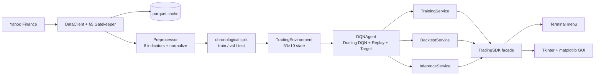
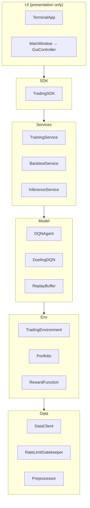
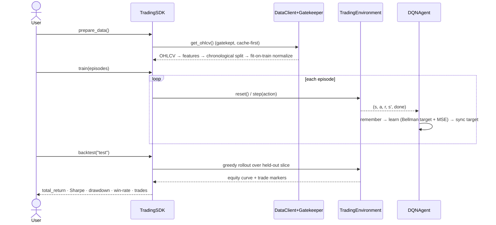

# TradeDQN — Stock-Trading Agent via a Dueling Deep Q-Network

> Bar-Ilan University · Vibe Coding Workshop · **Assignment 2**
>
> ⚠️ **Teaching tool, not investment advice.** No profitability is claimed or
> implied, and **past performance does not predict future results.** The agent
> is trained and evaluated only to demonstrate Deep Q-Learning — do not trade on it.

A reinforcement-learning agent that learns a discrete **Buy / Hold / Sell**
policy on historical market data. It replaces Assignment 1's tabular Q-table
with a **Dueling Deep Q-Network** — a neural network that *approximates* Q —
because the trading state space (a 30-day × 10-feature window) is effectively
infinite and can't fit in a table.

## Objective

Show the progression **finite Q-table → Bellman update → neural approximation
(DQN) → a working DQN-stock system**: connect real market data, engineer
features, wrap them in an RL environment, train a Dueling DQN with experience
replay and a target network, and **backtest** the policy against a Buy & Hold
benchmark — all behind one SDK with both a terminal and a GUI.

## What's implemented

- **Data** — `DataClient` pulls OHLCV from Yahoo Finance (AAPL, 2020-01-01→2023-01-01)
  with a **rate-limit gatekeeper** (§5) and a local **parquet cache** (`data/raw/`,
  snappy) + a `{ticker}.csv` fallback — offline, reproducible.
- **Features** — the brief's 8 market features (`log_return`, `rsi_14`, `macd`,
  `macd_signal`, `macd_hist`, `bb_pct`, `vwap_dist`, `volume_norm`), min-max
  normalized *fit-on-train* (no look-ahead), chronological 70/15/15 split.
- **Environment** — `TradingEnvironment`: 30×10 state (8 market + 2 portfolio
  channels `position`, `unrealized_pnl`), Sell/Hold/Buy, reward
  `rₜ = ΔVₜ − Cₜ − Sₜ + λ·Sharpeₜ`.
- **Model** — Dueling Conv1D DQN, experience replay, target network.
- **Services** — training loop, backtest (equity vs Buy & Hold + metrics),
  single-step inference.
- **Interfaces** — a **terminal menu** (built first) and a **Tkinter +
  matplotlib GUI**, both over the same `TradingSDK`.

## Architecture (data flow)

The UIs depend only on the SDK; the SDK orchestrates the engine (§4 mandate).



## OOP layers (responsibility separation)



**Sequence — one Prepare → Train → Backtest cycle** (UML, §20.1):



## Network — Dueling Conv1D DQN

```
input (B, 30 days, 10 features)
  → Conv1D 10→32  (k=3, over the TIME axis only)
  → Conv1D 32→64
  → Flatten → Dense(128)
  → split ──> Value head     V(s)      (scalar)
          └─> Advantage head A(s,a)    (3: Sell/Hold/Buy)
  → Q(s,a) = V(s) + A(s,a) − mean_a' A(s,a')
```
Conv1D convolves the **time** axis (features are channels, never convolved
across). The Dueling split learns "how good is this state" separately from
"which action is relatively better".

## The §5 gatekeeper

Yahoo Finance rate-limits rapid calls. `RateLimitGatekeeper` enforces a minimum
interval **and** a max-calls-per-window before any live fetch; `DataClient` is
**cache-first** (returns the local parquet when present, with a `{ticker}.csv`
fallback), so one pull is cached and every subsequent run is offline and reproducible.

## Installation

```bash
uv sync --dev
```

Run from the project checkout — `uv` installs the package editable, so
`config/config.yaml` (at the repo root) is found automatically; if it's ever
missing the loader fails with a clear message.

## Running

```bash
uv run main.py          # terminal menu: Prepare → Train → Backtest → Recommend
uv run main.py gui      # Tkinter + matplotlib dashboard

# regenerate the results below (fetches Yahoo once, then trains + backtests):
uv run python scripts/generate_results.py --episodes 300
```

A typical session: **Prepare data** (fetch + cache + features + split) → **Train**
(per-episode reward/ε/loss printed) → **Backtest** (equity vs Buy&Hold + metrics)
→ **Recommend** (latest window → Buy/Hold/Sell). Each terminal action prints its
result; the GUI shows the same via a status line + an embedded chart.

## Configuration

All tunable parameters live in [`config/config.yaml`](config/config.yaml) — there
are **no hardcoded values** in source (§7). The file carries a `version` key that
the loader validates at startup. Key groups:

| Group | Keys | Effect |
|---|---|---|
| `data` | `ticker`, `start`, `end`, `interval`, `cache_dir`, `rate_limit.*` | which symbol/period to fetch; §5 gatekeeper throttle + cache |
| `features` | `window_size` (30), `features_count` (10), `names`, indicator periods, `normalize` | the 30×10 state and how indicators are computed/scaled |
| `split` | `train`/`validation`/`test` | chronological split ratios (no look-ahead) |
| `env` | `initial_capital`, `transaction_cost`, `slippage`, `risk_lambda`, `sharpe_window` | reward `r = ΔV − C − S + λ·Sharpe` |
| `network` | `conv_channels` `[32,64]`, `kernel_size`, `dense_units` | Dueling Conv1D DQN shape |
| `training` | `gamma`, `learning_rate`, `episodes`, `epsilon_*`, `replay_capacity`, `batch_size`, `train_frequency`, `target_update_frequency` | the DQN learning loop |
| (top-level) | `seed` (42), `version` | global RNG seed → reproducible runs; config-schema version (§8) |

Edit values, re-run — nothing in code needs to change.

## Extending it

The `TradingSDK` constructor is the supported extension surface (dependency
injection): `TradingSDK(cfg=…, data_client=…, agent=…)`. To add:

- **a new indicator** → add one pure function in [`features/indicators.py`](src/tradedqn/features/indicators.py) and reference it in `Preprocessor` + the `features.names`/`features_count` config (one module + config).
- **a new reward term** → add it in [`env/reward.py`](src/tradedqn/env/reward.py) `RewardFunction.compute` (one place; components are returned in `info`).
- **a different data source** → implement an object with `get_ohlcv(...)` and inject it as `data_client` — no engine change.
- **a different network** → swap the `agent`'s policy/target builder; the SDK/UIs are untouched.

## Concurrency & thread safety (§15)

The training loop is **deliberately single-threaded**. The two cost centres are
**CPU-bound** (PyTorch forward/backward in training & inference) and **I/O-bound**
(the one rate-limited Yahoo fetch, which is cache-first so it usually makes zero
calls). For a single sequential RL loop over one symbol at this scale, process/
thread parallelism adds complexity without a real win, and the GIL is not the
bottleneck. `RateLimitGatekeeper` keeps mutable state (a timestamp deque) and is
**single-threaded by contract** — not thread-safe; if training is ever fanned out
(e.g. a parallel multi-ticker sweep), wrap its `acquire`/`execute` in a lock or
give each worker its own gatekeeper.

## User interface & UX (§10)

Two interfaces, both over the same SDK. **Terminal** (real captured session,
[`assets/terminal_session.txt`](assets/terminal_session.txt)):

```
$ uv run main.py
=== TradeDQN ===
  1. Prepare data   2. Train   3. Backtest
  4. Recommend next action   5. Save brain   6. Load brain   0. Quit
Select: 1
Prepared splits: {'train': 515, 'validation': 110, 'test': 112}
Select: 2
Trained 300 episode(s); ε=0.050  final value=344403.66
Select: 3
Backtest: total_return=-17.49%  benchmark=-16.47%  Sharpe=-1.66  max_drawdown=19.41%  win_rate=20.00%  trades=21
Select: 4
Recommended action: BUY  (Q = [13.882, 13.827, 14.056])
```

> Lightly reformatted (menu condensed, input digits inlined) from a real run captured
> verbatim to [`assets/terminal_session.txt`](assets/terminal_session.txt). Seeded
> (`config.seed`), so it reproduces the **Results** numbers below exactly — the menu's
> Train uses the config default of 300 episodes.

**GUI** (Tkinter + matplotlib) — a toolbar drives the SDK with inputs you can
play with: a **ticker** + **date range** (train on AAPL, MSFT, TSLA…), an
**episodes** count, and five actions:

- **Prepare data** — fetch + split + normalize the chosen symbol/range.
- **Train** — streams a **live-animating** reward + ε chart and a progress bar
  episode-by-episode, instead of freezing the window.
- **Backtest** — a two-panel figure: the **price with ▲buy / ▼sell markers**
  (you see *when* the agent traded) over the **equity-vs-Buy & Hold** curve.
- **Recommend** — a **Q-value bar chart** (Sell/Hold/Buy) with the chosen action
  highlighted.
- **Compare arch** — trains a **Dueling** vs a **plain DQN** on the same data and
  overlays their reward curves (the §9 ablation, live from the GUI).

The shot below is the real window (`uv run main.py gui`), captured by
`scripts/capture_gui.py`:


The other GUI states, same window (all real captures via `scripts/capture_gui.py --view …`):


> A genuine capture, not a mockup — regenerate any time with
> `uv run python scripts/capture_gui.py`. The numbers come from a short demo
> train; over so few episodes the outcome swings either side of Buy & Hold
> run-to-run (the honest small-sample story in **Results**). The episode count
> defaults from `config.yaml` (`gui.default_train_episodes`); the dueling head is
> toggled by `network.dueling`.
>
> **Running the GUI under uv.** The uv-managed (standalone) Python ships Tcl/Tk
> but hardcodes the build machine's search path, so a bare `tkinter.Tk()` would
> abort with *"Tcl wasn't installed properly."* `gui/tcl_setup.py` fixes this at
> launch by pointing `TCL_LIBRARY`/`TK_LIBRARY` at the interpreter's own bundled
> Tcl/Tk (and leaves a system/Homebrew Python untouched) — so `uv run main.py gui`
> just works, no manual setup.

**UX quality criteria.** *Learnability* — labelled buttons in pipeline order.
*Efficiency* — single keypress / click per action. *Memorability* — the same
Prepare→Train→Backtest→Recommend order in both UIs (the GUI adds Compare).
*Error prevention* — actions are safe in any order; calling Train before Prepare
yields a clear message, not a crash. *Satisfaction* — immediate textual + chart
feedback, with training animating live.

**Nielsen's 10 heuristics.** (1) *Visibility of status* — every action prints/
shows its result + a status line. (2) *Match to real world* — Buy/Hold/Sell,
return, Sharpe, drawdown. (3) *User control* — Quit any time; Save/Load brain.
(4) *Consistency* — identical action set + order across terminal and GUI.
(5) *Error prevention* — handlers are wrapped; misuse surfaces a message.
(6) *Recognition over recall* — labelled menu/buttons, no commands to memorise.
(7) *Flexibility* — terminal for agents/automation, GUI for presentation.
(8) *Aesthetic & minimalist* — only the five GUI buttons (six terminal-menu items); no clutter.
(9) *Help users recover from errors* — `Error: call prepare_data() first` etc.,
caught and shown. (10) *Help & documentation* — this README + `docs/`.

**Accessibility.** Fully **keyboard-operable** (terminal is keyboard-only; Tk
buttons are tab/Enter reachable). Status is **text**, not colour-coded, so it's
screen-reader / colour-blind friendly; chart lines use a distinct colour **and**
a dashed vs solid style (not colour alone). Known limitations: no explicit ARIA/
screen-reader testing; chart colours are not formally CVD-checked.

## Results & analysis

<!-- RESULTS:START (filled by scripts/generate_results.py) -->
**Real run — AAPL, 2020-01-01→2023-01-01 (the binding §4 window), 300 training
episodes.** Chronological split: train 515 days · validation 110 · test 112.
Evaluated **greedy** on the held-out **test** slice it never trained on.


| Metric (held-out test, 112 days) | DQN policy | Buy & Hold |
|---|---:|---:|
| Total return | **−17.5 %** | −16.5 % |
| Sharpe ratio | −1.66 | — |
| Max drawdown | 19.4 % | — |
| Win rate (round-trips) | 20.0 % | — |
| Trades | 21 | 1 |
| Latest recommendation | **BUY** | — |

**The test window is AAPL's 2022 drawdown**, so *both* lost money. The DQN ends
within ~1 point of simply holding (−17.5 % vs −16.5 %) but with a **negative
Sharpe (−1.66)** — no risk-adjusted edge. Set against that, training compounds
the $10k stake to **~$344k in-sample**: a stark in-sample/out-of-sample gap that
is the real finding (see Conclusions).

Numbers from [`results/analysis/backtest_metrics.json`](results/analysis/backtest_metrics.json);
reproduce with `uv run python scripts/generate_results.py --episodes 300`. The run is
**seeded** (`config.seed`) — Python/NumPy/Torch RNGs are fixed, so a fresh run on the
same machine reproduces these numbers exactly (verified across two independent runs).
<!-- RESULTS:END -->

> **Read the equity curve honestly.** The question is **not** "does the line go
> up" — on a rising market almost anything does. It's whether the **DQN policy
> beats Buy & Hold on a risk-adjusted basis** (Sharpe), trades economically
> (few trades, low drawdown), and **generalises to the held-out test slice it
> never trained on**. A DQN frequently *underperforms* Buy & Hold out-of-sample
> — and if it does here, that is reported, not hidden. **Past ≠ future.**

## Conclusions

<!-- CONCLUSIONS:START -->
**The headline is an honest "no demonstrable edge" — exactly what the brief asks
us to surface.** On the held-out 2022 test slice the DQN returns
**−17.5 % (Sharpe −1.66)** versus Buy & Hold's **−16.5 %**: it lands within a
point of simply holding on raw return, but **never beats the benchmark and loses
on a risk-adjusted basis** (negative Sharpe). Two things are true and reported,
not hidden:

- **No risk-adjusted edge out-of-sample** (−17.5 % vs −16.5 %, Sharpe −1.66) —
  it roughly matches Buy & Hold on return but took more risk to get there, so
  holding was strictly the better choice.
- **In-sample ≫ out-of-sample.** Training compounds the $10k stake to **~$344k**
  while the unseen test slice only matches Buy & Hold — the agent fits the
  2020–2021 bull regime and carries no real edge into the 2022 regime shift.
  Textbook overfitting on a single ticker over a single regime.

Why, and what I'd do differently:

- **Regularise:** dropout / weight decay, a smaller network, **early-stopping on
  the validation Sharpe** (not on training reward), and training across
  **multiple tickers / regimes** so the policy can't memorise one symbol.
- **Re-weight risk / cut churn:** the Sharpe-heavy reward (λ=1.0) plus 21 trades
  in a falling market hurt; tune the cost/risk weights on validation.
- **Sweep hyperparameters** (γ, learning rate, λ, network size) on the
  **validation** split before ever touching test (done — see the §9 sweep).

**Markets are hard, and that's the point.** The deliverable is a correct, honest
DQN *system* with an analysable result — not a profitable trader. **Past ≠
future.**

**Honest self-assessment.** This is solid, careful engineering — but not flawless,
and **I don't think it deserves a 100**. The overfitting, the single-ticker /
single-regime scope, the negative out-of-sample Sharpe, and the deliberately
deferred minors (no env-var bridge, single-seed reporting) are real gaps I'd close
before calling it complete. The grade should reflect a project that holds up under
a strict reading, not a perfect one.
<!-- CONCLUSIONS:END -->

## Concept Q&A (§13)

The twelve questions the brief requires the README to answer, with pointers to the code:

1. **What does Q represent (vs predicting tomorrow's price)?** `Q(s,a;θ)` is the expected *discounted cumulative reward* of taking action `a` in state `s` then following the policy — the value of a *decision*, not a price forecast. The net never predicts the next price; it ranks Sell/Hold/Buy by long-run portfolio value ([network.py](src/tradedqn/model/network.py)).
2. **Why function approximation, not a Q-Table?** The state `sₜ ∈ ℝ^{30×10}` is continuous and high-dimensional — a table would need a cell per distinct window (effectively infinite, never revisited). A Conv1D net generalises across unseen states via a parametric `Q(s,a;θ)`.
3. **How does the reward shape the policy?** The objective *is* the reward: `rₜ = ΔVₜ − Cₜ − Sₜ + λ·Sharpeₜ` rewards risk-adjusted PnL net of cost, so the agent learns to trade economically rather than maximise turnover ([reward.py](src/tradedqn/env/reward.py)).
4. **Reward = immediate profit only, no trade-cost penalty?** The agent would over-trade — churning every bar — since costs are invisible to it; real returns then vanish into fees/slippage. Our `Cₜ`/`Sₜ` terms penalise exactly that.
5. **Why not mix Test into training; what is leakage?** The split is chronological (never shuffled); Test is strictly *after* train/val. Leakage = letting future info (future prices, or normalization stats fit on the whole series) bleed into training, inflating the backtest. We fit the normalizer on **train only** ([dataset.py](src/tradedqn/features/dataset.py)).
6. **When is Hold optimal?** When the expected move doesn't cover cost + slippage, or the position is already correct — trading would only burn fees. Hold is the no-op that preserves capital.
7. **How does Dueling help when mostly no action is needed?** The value head `V(s)` learns "how good is this state" *independent of action*; the advantage head learns the small per-action deltas. In a hold-dominated environment the shared `V(s)` is learned efficiently without sampling every `(s,a)` ([network.py](src/tradedqn/model/network.py)).
8. **Exploration (training) vs evaluation (backtest)?** Training is ε-greedy (random with prob ε to explore); the backtest is **greedy** (`argmax Q`, ε=0) — we evaluate the learned policy, not exploration noise ([agent.py](src/tradedqn/model/agent.py), [backtest.py](src/tradedqn/services/backtest.py)).
9. **Is Total Return enough?** No — a high return can hide huge risk. We also report **Sharpe** (risk-adjusted), **Max Drawdown** (worst pain), and **Win Rate** (consistency) so a lucky high-variance run can't pass as skill ([metrics.py](src/tradedqn/services/metrics.py)).
10. **Which env/reward bugs fake a good backtest?** Look-ahead (using `price[t+1]` in the state), normalization fit on the full series, an off-by-one reward (crediting a trade before it executes), or zero transaction cost — all inflate results. Our env executes at `prices[t]` with the next day only as *outcome*, and a test asserts no look-ahead ([trading_env.py](src/tradedqn/env/trading_env.py)).
11. **General policy vs an AAPL quirk?** Out-of-sample it shows *no edge* (−17.5% vs −16.5%, Sharpe −1.66) — evidence it fit AAPL's 2020–2021 regime, not a general edge. Proving generality requires train/test across **multiple tickers and regimes** with consistent held-out Sharpe.
12. **Extend to another (financial or non-financial) problem, same RL structure?** Swap the `Environment` behind the SDK: define a new `state`/`action`/`reward` (e.g. energy dispatch, inventory control) in a `TradingEnvironment`-shaped class; the agent / training / backtest / SDK layers are domain-agnostic ([Extending it](#extending-it)).

## Research notebook & sensitivity analysis (§9)

The full research write-up is the Jupyter notebook
[`notebooks/analysis.ipynb`](notebooks/analysis.ipynb): the RL formulation with the
governing equations (Bellman target, Dueling aggregation, reward, Sharpe — in
LaTeX), the held-out backtest with **falsifiable hypotheses** (H1: DQN return >
Buy & Hold; H2: Sharpe > 0) and their verdicts, the **one-at-a-time sensitivity
sweep** over `learning_rate` and `gamma` on the **validation** split (never the
test set), the overfitting analysis, and academic citations.

```bash
uv run python scripts/parameter_sweep.py --episodes 15        # → results/analysis/sweep.{json,png}
uv run --with jupyter jupyter lab notebooks/analysis.ipynb   # open the analysis (jupyter on demand)
```


## Cost of AI-assisted development

Runtime cost is negligible (a tiny Conv1D net, sub-ms inference); the real cost
is the human attention spent verifying generated code. Full breakdown in
[`docs/COST_ANALYSIS.md`](docs/COST_ANALYSIS.md) (§11). How the work was done —
PRD-first, 10 phases, the decisions and the AI-rework tax — is in
[`docs/PROMPTS.md`](docs/PROMPTS.md).

## Quality bar (ISO/IEC 25010 lens, §13)

| 25010 attribute | How it shows up here | Evidence |
|---|---|---|
| Functional suitability | full pipeline works end-to-end | `tests/integration/test_sdk.py` |
| Reliability | deterministic seeds; checkpoint reload reproduces | `test_agent`, `test_sdk` |
| Maintainability | ≤150-line single-purpose modules; SDK boundary; DRY | file-size gate, `assemble_state` reuse |
| Security | §5 rate-limit gatekeeper; `weights_only` load; path-traversal guard; secret-scan | `gatekeeper.py`, `agent.load`, `assert_in_project` |
| Performance efficiency | small net, CPU-fine; cache avoids refetch | `docs/COST_ANALYSIS.md` |
| Usability | terminal + GUI, both error-safe | `test_menu`, `test_gui_controller` |
| Compatibility | stdlib-only GUI (Tkinter), no new GUI dep; CSV/Yahoo data interop; one config consumed by every interface | `gui/`, `data/client.py`, `config/config.yaml` |
| Portability | pure-Python, `uv`-locked install; CPU/MPS device-agnostic; OS-independent paths | `uv.lock`, `model/agent.py` (`device`), `config.assert_in_project` |

**Gates** (pre-commit + CI): TDD with **100% coverage** (gate ≥85%), zero ruff
violations, ≤150 code lines/file, secret-scan, uv-only.

## Tests

```bash
uv run pytest tests/ --cov=src --cov-report=term-missing
```

## Project structure

```
src/tradedqn/
  data/        DataClient, RateLimitGatekeeper
  features/    indicators, Preprocessor, split + MinMaxNormalizer
  env/         TradingEnvironment, Portfolio, RewardFunction
  model/       DuelingDQN, ReplayBuffer, DQNAgent
  services/    training, backtest, inference, metrics
  gui/         charts, controller, app (Tkinter)
  cli/         terminal menu
  sdk.py       TradingSDK — the single entry point
config/config.yaml   all hyperparameters (no hardcoded values)
docs/          PRDs (per phase), ADRs, PROMPTS, COST_ANALYSIS
main.py        terminal (default) / gui entry point
```

## Contributing

Conventions for changes (the project enforces them via pre-commit + CI):

- **TDD** — write the test first; keep coverage ≥ 85% (this repo holds 100%).
- **≤ 150 code lines per `.py`** (blank/comment lines excluded) — `scripts/check_file_sizes.sh`.
- **Zero ruff violations** — `uv run ruff check src/ tests/ scripts/ main.py`.
- **No hardcoded values** — everything tunable goes in `config/config.yaml`.
- **uv only** — `uv sync --dev`; run everything via `uv run`.
- Run the full gate before committing:
  `uv run pytest tests/ --cov=src --cov-report=term-missing && uv run ruff check src/ tests/ scripts/ main.py`.

**Review process.** This is a single-author project, so there is no pull-request
flow — development lands on `main`. The role peer review plays on a team is
filled here by two gates: the **human↔AI responsibility contract** in `CLAUDE.md`
(requirements, architecture, test-acceptance, and final sign-off are
human-decided before any AI-generated change lands) and the **automated CI gate**
(tests + coverage + lint + file-size + secret-scan must pass). Commit messages
name the change's intent, giving a reviewable development arc.

## References

- Sutton & Barto (2018), *Reinforcement Learning: An Introduction*, 2nd ed. — RL, Bellman, policy/value.
- Watkins & Dayan (1992), *Q-learning* — the off-policy Q-update.
- Mnih et al. (2015), *Human-level control through deep reinforcement learning*, Nature — **DQN** (experience replay + target network).
- Wang et al. (2016), *Dueling Network Architectures for Deep Reinforcement Learning* — the **Dueling** value/advantage split used here.
- Fischer (2018), survey on *Reinforcement Learning in Financial Markets* — trading env, costs, backtesting.
- Hugging Face *Deep RL Course*, Unit 3 — ε-greedy, Bellman target, replay.
**Standards & sources referenced** (§18):
- **ISO/IEC 25010** — product-quality model; the "Quality bar" table maps all 8 characteristics.
- **Nielsen's 10 usability heuristics** — mapped in the UI & UX section.
- **PEP 8 / ruff** — code style, enforced in CI + pre-commit.
- **MIT Software QA Plan** — informs the verification plan (TDD, 100% statement+branch coverage, lint/secret/file-size gates).
- **Google Engineering Practices** (*eng-practices*) — small, reviewable changes + commit-intent / sign-off discipline (the human↔AI review process).
- **Microsoft REST API Guidelines** — consistent verb/noun naming applied to the SDK's public surface (`prepare_data` / `train` / `backtest` / `recommend`).

## Credits

- **Data**: [Yahoo Finance](https://finance.yahoo.com/) via [`yfinance`](https://github.com/ranaroussi/yfinance).
- **Libraries**: PyTorch, NumPy, pandas, Matplotlib, PyYAML; tooling: uv, ruff, pytest.
- Built for the Bar-Ilan University Vibe Coding Workshop (Dr. Yoram Segal).

## License

MIT — see [LICENSE](LICENSE).
