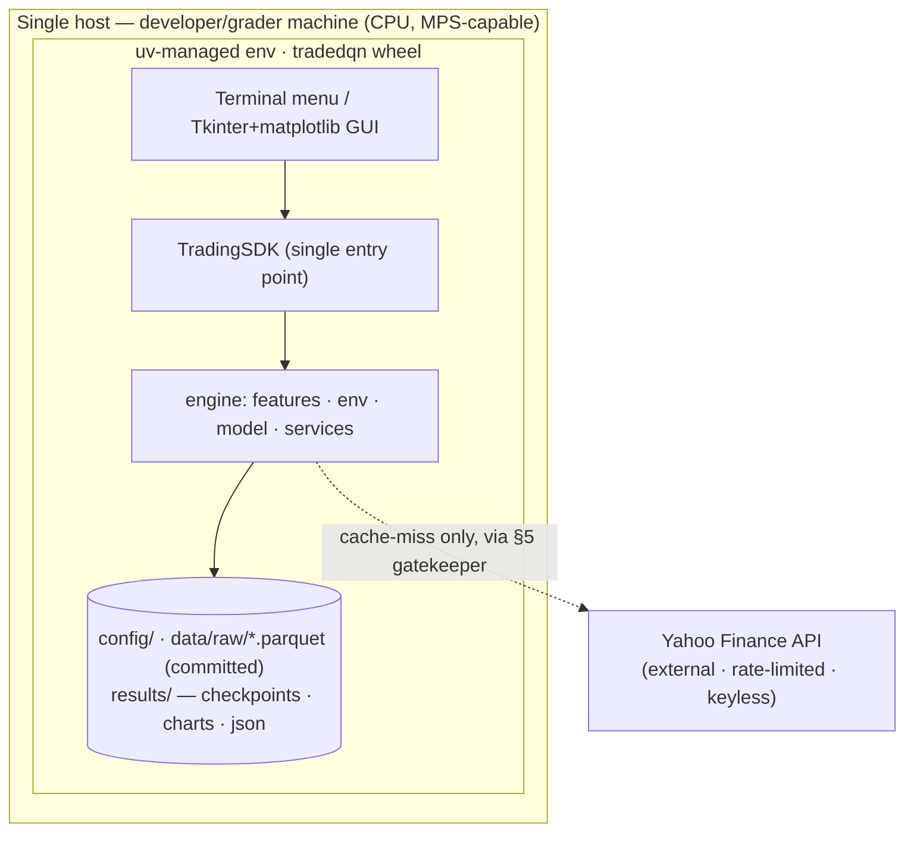

# PLAN — architecture & design (TradeDQN)

Design/architecture doc (§2.2). Diagrams render in the README; this is the
single place that aggregates architecture, layering, ADRs, interface contracts,
and the concurrency decision.

## Architecture (C4-ish)

**Context.** One user (or AI agent) drives TradeDQN; the only external system is
Yahoo Finance (market data). No DB, no broker.

**Containers / layers** (Consumers → SDK → Services → Domain → Infrastructure):

```
UI:    TerminalApp (cli/menu.py) , MainWindow→GuiController (gui/)
        │  (presentation only; depend ONLY on the SDK)
SDK:    TradingSDK (sdk.py)                      ← single business-logic entry point (§4)
        │
Svc:    TrainingService , BacktestService , InferenceService , metrics
        │
Model:  DQNAgent → DuelingDQN + ReplayBuffer + (target net)
Env:    TradingEnvironment → Portfolio + RewardFunction
Data:   DataClient → RateLimitGatekeeper (§5) + parquet cache ; Preprocessor + split/normalizer
Infra:  Yahoo Finance (yfinance) , local parquet cache , torch checkpoints
```

The README contains the rendered **data-flow** and **OOP-layers** mermaid
diagrams plus the **Dueling Conv1D network** diagram. Dependency rule: arrows
point downward only — a UI never imports an engine module; the SDK is the seam.

### C4-level diagram map (§2.2.2b)
The diagrams collectively cover the C4 model; each is labelled with the level it
actually serves (no level is claimed without a backing diagram):

| C4 level | Served by | What it shows |
|---|---|---|
| **L1 — Context** | [deployment.mmd](diagrams/deployment.mmd) (doubles as context) | the one user/agent, the TradeDQN system, the single external system (Yahoo Finance, keyless) |
| **L2 — Container** | [deployment.mmd](diagrams/deployment.mmd) + [oop_layers.mmd](diagrams/oop_layers.mmd) | single-host app: UI → SDK → engine → local filesystem; one process, single-threaded (§15) |
| **L3 — Component** | [oop_layers.mmd](diagrams/oop_layers.mmd) + [architecture_data_flow.mmd](diagrams/architecture_data_flow.mmd) | named classes per layer + the data path between them; interface contracts in the table below |
| **L4 — Code** | README *Network — Dueling Conv1D DQN* | internals of one component (`DuelingDQN`): Conv1D → Dense → Value/Advantage split → Q-aggregation |
| **Dynamic (UML)** | [sequence_backtest.mmd](diagrams/sequence_backtest.mmd) | UML sequence for one Prepare→Train→Backtest cycle (a C4 supplement, not a level) |

No standalone single-purpose Context diagram nor a separate UML class diagram
exists — the deployment diagram serves Context/Container and the OOP-layers
diagram is the de-facto Component/code-structure view.

## Components (interface contracts)
| Component | Key interface |
|---|---|
| `TradingSDK` | `prepare_data() → {split:n}`, `train(episodes) → history`, `backtest(split) → metrics`, `recommend(split) → {action,q}`, `save_brain/load_brain(path)` |
| `DataClient` | `get_ohlcv(ticker,start,end,interval,force_refresh) → DataFrame` (cache-first, gatekept) |
| `RateLimitGatekeeper` | `acquire(wait=True) → waited_seconds` (min-interval + sliding-window) |
| `TradingEnvironment` | `reset() → state(30×10)`, `step(action) → (state, reward, done, info)` |
| `DQNAgent` | `act(state,greedy) → int`, `q_values(state)`, `q_saliency(state)` (inference depends on it), `remember(...)`, `learn() → loss\|None`, `save/load` |
| `BacktestService` | `run() → {equity_curve, benchmark_curve, total_return, sharpe_ratio, max_drawdown, win_rate, num_trades}` |

## Architecture Decision Records
- **ADR-001** — config format: YAML over the deck's `setup.json` (inline-documented
  hyperparameters; deck parameter *names* kept). See [ADR-001-config-format.md](ADR-001-config-format.md).
- **ADR-002** — absolute intra-package imports (`from tradedqn.…`) over relative, for
  `src`-layout + installed-wheel parity. See [ADR-002-absolute-imports.md](ADR-002-absolute-imports.md).
- **ADR (PRD_env D1)** — all-in/all-out position model (deck's "have stock or not").
- **ADR (PRD_env D3)** — reward `r = ΔV − C − S + λ·Sharpe` (risk/cost-adjusted, not raw profit).
- **ADR (PRD_gui)** — Tkinter + matplotlib GUI (stdlib + existing dep) over Streamlit.

## Deployment / operational architecture (§20.1)
No server, container, or network service — TradeDQN deploys as a **single-host
desktop/CLI app**: an installable wheel (`uv build` → `dist/tradedqn-1.0.0-py3-none-any.whl`)
or run-in-place via `uv run main.py [gui]`. It runs **CPU-only by default**
(device-parameterised, MPS/CUDA-capable), needs **no credentials** (Yahoo data is
public/keyless), and is **offline after the first fetch** (the committed parquet
cache serves every subsequent run).



**Runtime:** one process, single-threaded (§15). **Persistence:** local filesystem
only (parquet cache, checkpoints, result artifacts) — no DB, no secrets store.
**Install/run:** `uv sync --dev` then `uv run main.py` (CLI) or `uv run main.py gui`
(dashboard); or install the built wheel. **Scale-out path:** a multi-ticker sweep
fans per-ticker training across a `multiprocessing.Pool`, each worker with its own
gatekeeper (see below). Mermaid source: [diagrams/deployment.mmd](diagrams/deployment.mmd).

## Concurrency & thread safety (§15)
The pipeline is **single-threaded by design**. Cost centres: **CPU-bound**
(PyTorch forward/backward in training & inference) and **I/O-bound** (one
rate-limited Yahoo fetch, cache-first → usually zero calls). For a single
sequential RL loop over one symbol at this scale, multiprocessing/threading adds
complexity with no real gain and the GIL is not the bottleneck.
`RateLimitGatekeeper` holds mutable state (a timestamp deque) and is
**single-threaded by contract — not thread-safe**; a future parallel multi-ticker
sweep must give each worker its own gatekeeper or guard `acquire`/`execute` with
a lock, and use a `multiprocessing.Pool` for the embarrassingly-parallel
per-ticker training.

## Build sequence
10 phases, each a PRD + a TDD commit (data → features → env → network → training
→ backtest → SDK → terminal → GUI → docs). Status + definition-of-done: [TODO.md](TODO.md).

## Milestones & checkpoints (§2.2)
Sequenced as phase-milestones rather than calendar dates (solo, single-deadline
project — final submission due **2026-06-03**). Each milestone is a checkpoint:
"reached" only when its PRD is approved, its TDD commit lands, and all gates are
green (ruff, ≤150 code-lines, coverage ≥85%, secret-scan).

| Milestone (checkpoint) | Phases | Exit criterion |
|---|---|---|
| **M1 — Data & features ready** | 1–2 | OHLCV cached + 8 indicators, fit-on-train split, tests green |
| **M2 — Environment playable** | 3 | `reset/step` returns the 30×10 state + reward, tests green |
| **M3 — Learning loop closes** | 4–5 | Dueling DQN trains via replay + target net; loss behaves, tests green |
| **M4 — End-to-end pipeline** | 6–7 | backtest vs Buy&Hold + inference behind the `TradingSDK`, tests green |
| **M5 — Usable product** | 8–9 | terminal menu + GUI run through the SDK, tests green |
| **M6 — Submission-ready** | 10 | docs + real results + diagrams; pre-submission review passed |

Milestones are strictly ordered (each depends on the prior); no parallel track.
Per-phase status: [TODO.md](TODO.md).
